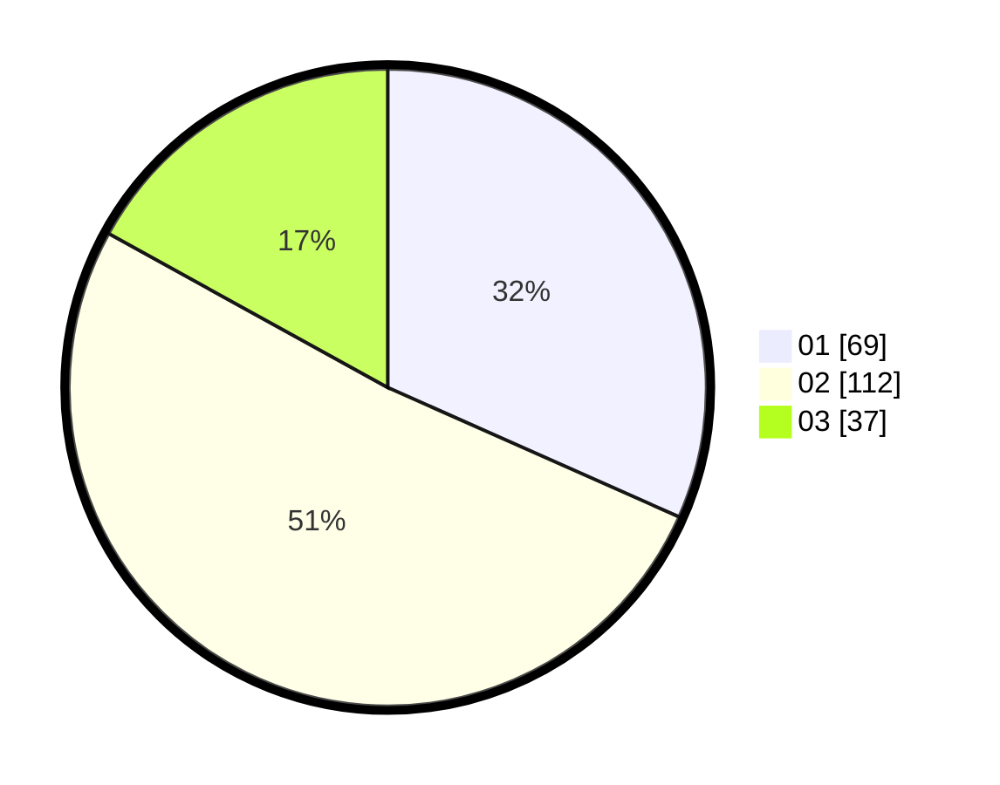

# Hasil

Hasil perolehan suara paslon dapat dilihat pada file paslon-01.txt, paslon-02.txt, dan paslon-03.txt.

Jika tidak ada, artinya data tersebut belum ada pada SIREKAP.

## Perolehan Suara

 * Paslon 01: **69**.
 * Paslon 02: **112**.
 * Paslon 03: **37**.

## Foto C Plano

https://sirekap-obj-formc.kpu.go.id/87a8/pemilu/ppwp/31/73/01/10/03/3173011003124-20240216-022352--94800f47-0ea3-4d1f-bd41-7eb57104602a.jpg

https://sirekap-obj-formc.kpu.go.id/87a8/pemilu/ppwp/31/73/01/10/03/3173011003124-20240216-022354--c49b461e-409b-4acb-8cc0-d1615e5a7217.jpg

https://sirekap-obj-formc.kpu.go.id/87a8/pemilu/ppwp/31/73/01/10/03/3173011003124-20240216-022353--00ff06fc-b618-441a-9dd2-2ff08ff392f6.jpg

## DATA PEMILIH TETAP

Jumlah pemilih dalam DPT: **266**.
 * L: **127**.
 * P: **139**.

## DATA PENGGUNA HAK PILIH

Jumlah pengguna hak pilih dalam DPT: **217**.
 * L: **99**.
 * P: **118**.

Jumlah pengguna hak pilih dalam DPTb: **0**.
 * L: **0**.
 * P: **0**.

Jumlah pengguna hak pilih dalam DPK: **2**.
 * L: **1**.
 * P: **1**.

Jumlah pengguna hak pilih: **219**.
 * L: **100**.
 * P: **119**.

## JUMLAH SUARA SAH DAN TIDAK SAH

JUMLAH SELURUH SUARA SAH: **218**.

JUMLAH SUARA TIDAK SAH: **1**.

JUMLAH SELURUH SUARA SAH DAN SUARA TIDAK SAH: **219**.
