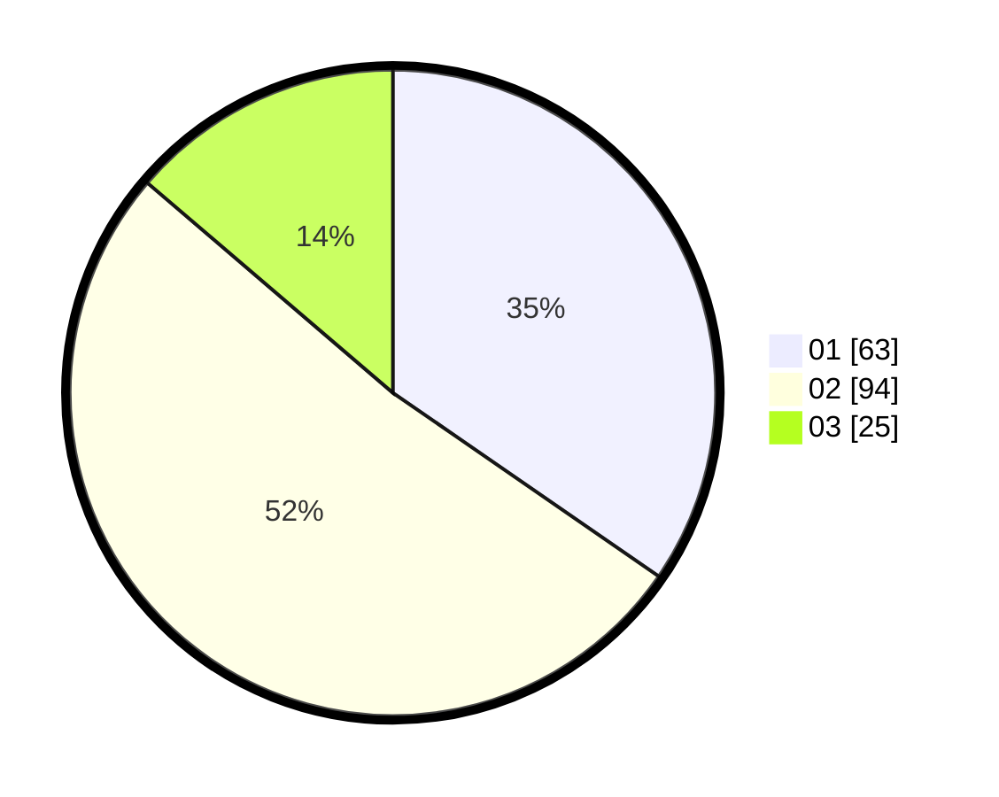

# Hasil

Hasil perolehan suara paslon dapat dilihat pada file paslon-01.txt, paslon-02.txt, dan paslon-03.txt.

Jika tidak ada, artinya data tersebut belum ada pada SIREKAP.

## Perolehan Suara

 * Paslon 01: **63**.
 * Paslon 02: **94**.
 * Paslon 03: **25**.

## Foto C Plano

https://sirekap-obj-formc.kpu.go.id/9c5d/pemilu/ppwp/31/73/01/10/03/3173011003125-20240216-015200--30c26c3c-4944-48c5-8084-4ffa45e1ee3c.jpg

https://sirekap-obj-formc.kpu.go.id/9c5d/pemilu/ppwp/31/73/01/10/03/3173011003125-20240216-142948--6a7de760-7618-4a0d-af78-34a93381da1b.jpg

https://sirekap-obj-formc.kpu.go.id/9c5d/pemilu/ppwp/31/73/01/10/03/3173011003125-20240216-015204--d9b69ff2-6ee0-4f92-97ad-0e56c48d51a9.jpg

## DATA PEMILIH TETAP

Jumlah pemilih dalam DPT: **250**.
 * L: **133**.
 * P: **117**.

## DATA PENGGUNA HAK PILIH

Jumlah pengguna hak pilih dalam DPT: **187**.
 * L: **85**.
 * P: **102**.

Jumlah pengguna hak pilih dalam DPTb: **1**.
 * L: **0**.
 * P: **1**.

Jumlah pengguna hak pilih dalam DPK: **0**.
 * L: **0**.
 * P: **0**.

Jumlah pengguna hak pilih: **188**.
 * L: **85**.
 * P: **103**.

## JUMLAH SUARA SAH DAN TIDAK SAH

JUMLAH SELURUH SUARA SAH: **182**.

JUMLAH SUARA TIDAK SAH: **6**.

JUMLAH SELURUH SUARA SAH DAN SUARA TIDAK SAH: **188**.
