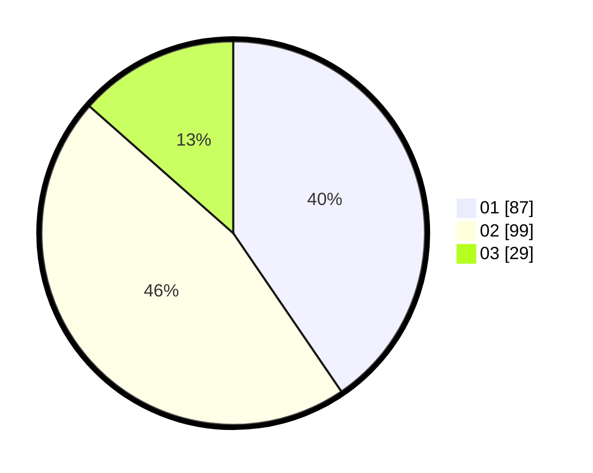

# Hasil

Hasil perolehan suara paslon dapat dilihat pada file paslon-01.txt, paslon-02.txt, dan paslon-03.txt.

Jika tidak ada, artinya data tersebut belum ada pada SIREKAP.

## Perolehan Suara

 * Paslon 01: **87**.
 * Paslon 02: **99**.
 * Paslon 03: **29**.

## Foto C Plano

https://sirekap-obj-formc.kpu.go.id/c7a7/pemilu/ppwp/31/73/01/10/03/3173011003126-20240215-234257--2897d428-c13f-4454-ab43-7983cb736df6.jpg

https://sirekap-obj-formc.kpu.go.id/c7a7/pemilu/ppwp/31/73/01/10/03/3173011003126-20240215-234258--e070d910-520e-43f0-9eb2-6645b59c7f82.jpg

https://sirekap-obj-formc.kpu.go.id/c7a7/pemilu/ppwp/31/73/01/10/03/3173011003126-20240215-234257--d43430e1-156e-42de-a248-0b27e3898be8.jpg

## DATA PEMILIH TETAP

Jumlah pemilih dalam DPT: **221**.
 * L: **115**.
 * P: **106**.

## DATA PENGGUNA HAK PILIH

Jumlah pengguna hak pilih dalam DPT: **217**.
 * L: **114**.
 * P: **103**.

Jumlah pengguna hak pilih dalam DPTb: **4**.
 * L: **1**.
 * P: **3**.

Jumlah pengguna hak pilih dalam DPK: **0**.
 * L: **0**.
 * P: **0**.

Jumlah pengguna hak pilih: **221**.
 * L: **115**.
 * P: **106**.

## JUMLAH SUARA SAH DAN TIDAK SAH

JUMLAH SELURUH SUARA SAH: **215**.

JUMLAH SUARA TIDAK SAH: **6**.

JUMLAH SELURUH SUARA SAH DAN SUARA TIDAK SAH: **221**.
