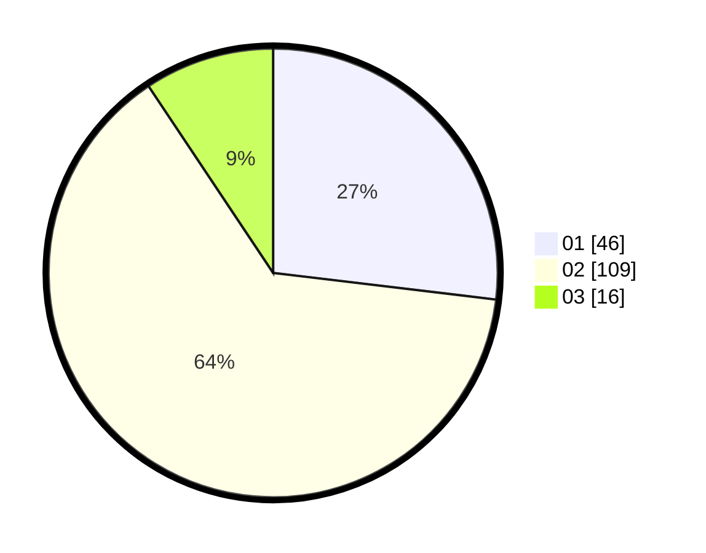

# Hasil

Hasil perolehan suara paslon dapat dilihat pada file paslon-01.txt, paslon-02.txt, dan paslon-03.txt.

Jika tidak ada, artinya data tersebut belum ada pada SIREKAP.

## Perolehan Suara

 * Paslon 01: **46**.
 * Paslon 02: **109**.
 * Paslon 03: **16**.

## Foto C Plano

https://sirekap-obj-formc.kpu.go.id/e4c7/pemilu/ppwp/31/73/01/10/03/3173011003129-20240216-031504--f561fbce-26d8-47e2-8c2f-e71bd72ce521.jpg

https://sirekap-obj-formc.kpu.go.id/e4c7/pemilu/ppwp/31/73/01/10/03/3173011003129-20240216-031517--413b6405-3da3-43ef-a73d-3b971c5b52c4.jpg

https://sirekap-obj-formc.kpu.go.id/e4c7/pemilu/ppwp/31/73/01/10/03/3173011003129-20240216-031510--d6f2dce1-aa97-4bc9-a950-90fa53e58d6c.jpg

## DATA PEMILIH TETAP

Jumlah pemilih dalam DPT: **240**.
 * L: **127**.
 * P: **113**.

## DATA PENGGUNA HAK PILIH

Jumlah pengguna hak pilih dalam DPT: **171**.
 * L: **82**.
 * P: **89**.

Jumlah pengguna hak pilih dalam DPTb: **0**.
 * L: **0**.
 * P: **0**.

Jumlah pengguna hak pilih dalam DPK: **3**.
 * L: **1**.
 * P: **2**.

Jumlah pengguna hak pilih: **174**.
 * L: **83**.
 * P: **91**.

## JUMLAH SUARA SAH DAN TIDAK SAH

JUMLAH SELURUH SUARA SAH: **171**.

JUMLAH SUARA TIDAK SAH: **3**.

JUMLAH SELURUH SUARA SAH DAN SUARA TIDAK SAH: **174**.
