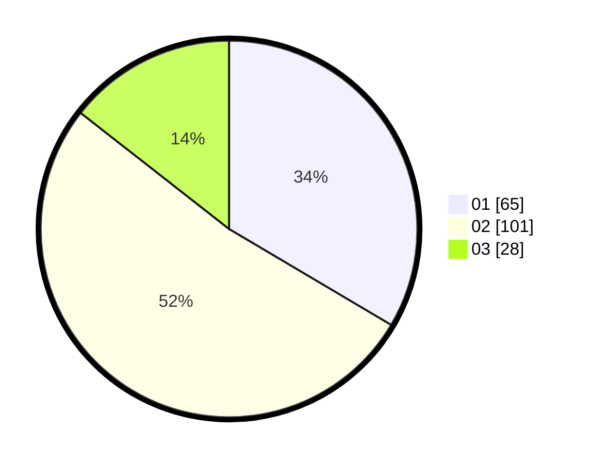

# Hasil

Hasil perolehan suara paslon dapat dilihat pada file paslon-01.txt, paslon-02.txt, dan paslon-03.txt.

Jika tidak ada, artinya data tersebut belum ada pada SIREKAP.

## Perolehan Suara

 * Paslon 01: **65**.
 * Paslon 02: **101**.
 * Paslon 03: **28**.

## Foto C Plano

https://sirekap-obj-formc.kpu.go.id/3017/pemilu/ppwp/31/73/01/10/03/3173011003132-20240216-064300--334c35cd-73a8-4a1b-8d37-597a2beed2ca.jpg

https://sirekap-obj-formc.kpu.go.id/3017/pemilu/ppwp/31/73/01/10/03/3173011003132-20240216-064303--2f59dff0-0646-454c-93b5-1f1af76fd4cb.jpg

https://sirekap-obj-formc.kpu.go.id/3017/pemilu/ppwp/31/73/01/10/03/3173011003132-20240216-064301--940b9a6a-141b-4ed8-a48b-d0cd25c51ab3.jpg

## DATA PEMILIH TETAP

Jumlah pemilih dalam DPT: **248**.
 * L: **119**.
 * P: **129**.

## DATA PENGGUNA HAK PILIH

Jumlah pengguna hak pilih dalam DPT: **196**.
 * L: **94**.
 * P: **102**.

Jumlah pengguna hak pilih dalam DPTb: **0**.
 * L: **0**.
 * P: **0**.

Jumlah pengguna hak pilih dalam DPK: **0**.
 * L: **0**.
 * P: **0**.

Jumlah pengguna hak pilih: **196**.
 * L: **94**.
 * P: **102**.

## JUMLAH SUARA SAH DAN TIDAK SAH

JUMLAH SELURUH SUARA SAH: **194**.

JUMLAH SUARA TIDAK SAH: **2**.

JUMLAH SELURUH SUARA SAH DAN SUARA TIDAK SAH: **196**.
