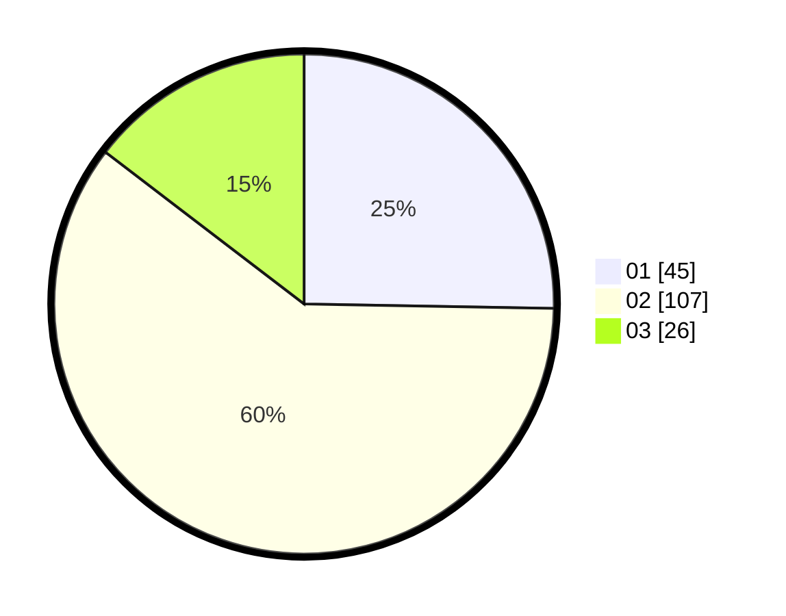

# Hasil

Hasil perolehan suara paslon dapat dilihat pada file paslon-01.txt, paslon-02.txt, dan paslon-03.txt.

Jika tidak ada, artinya data tersebut belum ada pada SIREKAP.

## Perolehan Suara

 * Paslon 01: **45**.
 * Paslon 02: **107**.
 * Paslon 03: **26**.

## Foto C Plano

https://sirekap-obj-formc.kpu.go.id/5399/pemilu/ppwp/31/73/01/10/03/3173011003133-20240216-163127--31dd004a-fe02-4b75-b6ed-3eb26f836b5f.jpg

https://sirekap-obj-formc.kpu.go.id/5399/pemilu/ppwp/31/73/01/10/03/3173011003133-20240216-163128--1452916f-1efe-41db-8578-3c66a61d2eb0.jpg

https://sirekap-obj-formc.kpu.go.id/5399/pemilu/ppwp/31/73/01/10/03/3173011003133-20240216-163127--85d38576-8857-412f-bb52-baace7fb3da8.jpg

## DATA PEMILIH TETAP

Jumlah pemilih dalam DPT: **225**.
 * L: **115**.
 * P: **110**.

## DATA PENGGUNA HAK PILIH

Jumlah pengguna hak pilih dalam DPT: **178**.
 * L: **84**.
 * P: **94**.

Jumlah pengguna hak pilih dalam DPTb: **0**.
 * L: **0**.
 * P: **0**.

Jumlah pengguna hak pilih dalam DPK: **3**.
 * L: **2**.
 * P: **1**.

Jumlah pengguna hak pilih: **181**.
 * L: **86**.
 * P: **95**.

## JUMLAH SUARA SAH DAN TIDAK SAH

JUMLAH SELURUH SUARA SAH: **178**.

JUMLAH SUARA TIDAK SAH: **3**.

JUMLAH SELURUH SUARA SAH DAN SUARA TIDAK SAH: **181**.
