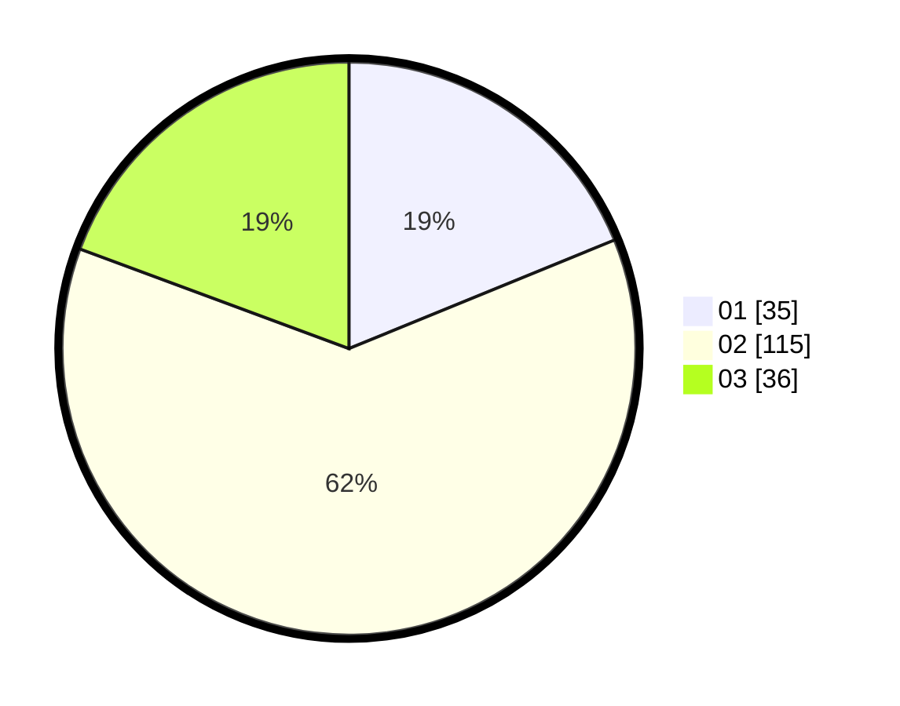

# Hasil

Hasil perolehan suara paslon dapat dilihat pada file paslon-01.txt, paslon-02.txt, dan paslon-03.txt.

Jika tidak ada, artinya data tersebut belum ada pada SIREKAP.

## Perolehan Suara

 * Paslon 01: **35**.
 * Paslon 02: **115**.
 * Paslon 03: **36**.

## Foto C Plano

https://sirekap-obj-formc.kpu.go.id/4577/pemilu/ppwp/31/73/01/10/03/3173011003135-20240217-072804--8908df87-ca24-4a02-8950-217e4888b0c5.jpg

https://sirekap-obj-formc.kpu.go.id/4577/pemilu/ppwp/31/73/01/10/03/3173011003135-20240217-072827--7dd4d68f-4ca8-4c32-84f2-7c3583cd7da7.jpg

https://sirekap-obj-formc.kpu.go.id/4577/pemilu/ppwp/31/73/01/10/03/3173011003135-20240217-072833--37fcccc1-f905-4905-8598-2a2a0e10b0cc.jpg
