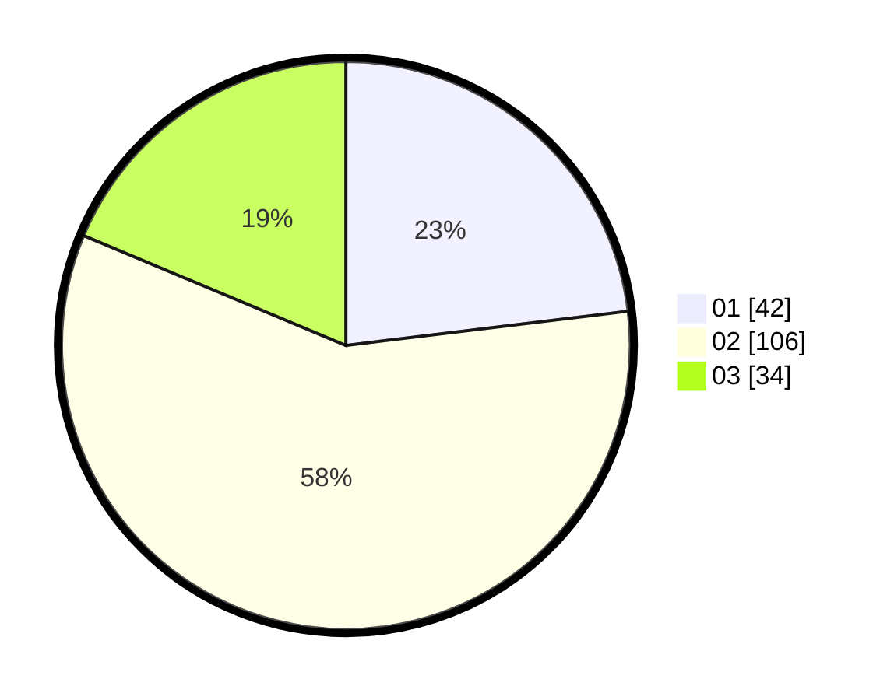

# Hasil

Hasil perolehan suara paslon dapat dilihat pada file paslon-01.txt, paslon-02.txt, dan paslon-03.txt.

Jika tidak ada, artinya data tersebut belum ada pada SIREKAP.

## Perolehan Suara

 * Paslon 01: **42**.
 * Paslon 02: **106**.
 * Paslon 03: **34**.

## Foto C Plano

https://sirekap-obj-formc.kpu.go.id/8b62/pemilu/ppwp/31/73/01/10/03/3173011003137-20240216-060225--168f8aec-cf9e-4d91-9686-3b4be2826c1b.jpg

https://sirekap-obj-formc.kpu.go.id/8b62/pemilu/ppwp/31/73/01/10/03/3173011003137-20240216-060226--7b0769d2-2ec8-4e00-9f65-6f0339107099.jpg

https://sirekap-obj-formc.kpu.go.id/8b62/pemilu/ppwp/31/73/01/10/03/3173011003137-20240216-060225--a7e1389f-b3ea-4dc3-82a8-c6eb2f1d972e.jpg

## DATA PEMILIH TETAP

Jumlah pemilih dalam DPT: **258**.
 * L: **143**.
 * P: **115**.

## DATA PENGGUNA HAK PILIH

Jumlah pengguna hak pilih dalam DPT: **178**.
 * L: **98**.
 * P: **80**.

Jumlah pengguna hak pilih dalam DPTb: **1**.
 * L: **1**.
 * P: **0**.

Jumlah pengguna hak pilih dalam DPK: **4**.
 * L: **2**.
 * P: **2**.

Jumlah pengguna hak pilih: **183**.
 * L: **101**.
 * P: **82**.

## JUMLAH SUARA SAH DAN TIDAK SAH

JUMLAH SELURUH SUARA SAH: **182**.

JUMLAH SUARA TIDAK SAH: **1**.

JUMLAH SELURUH SUARA SAH DAN SUARA TIDAK SAH: **183**.
