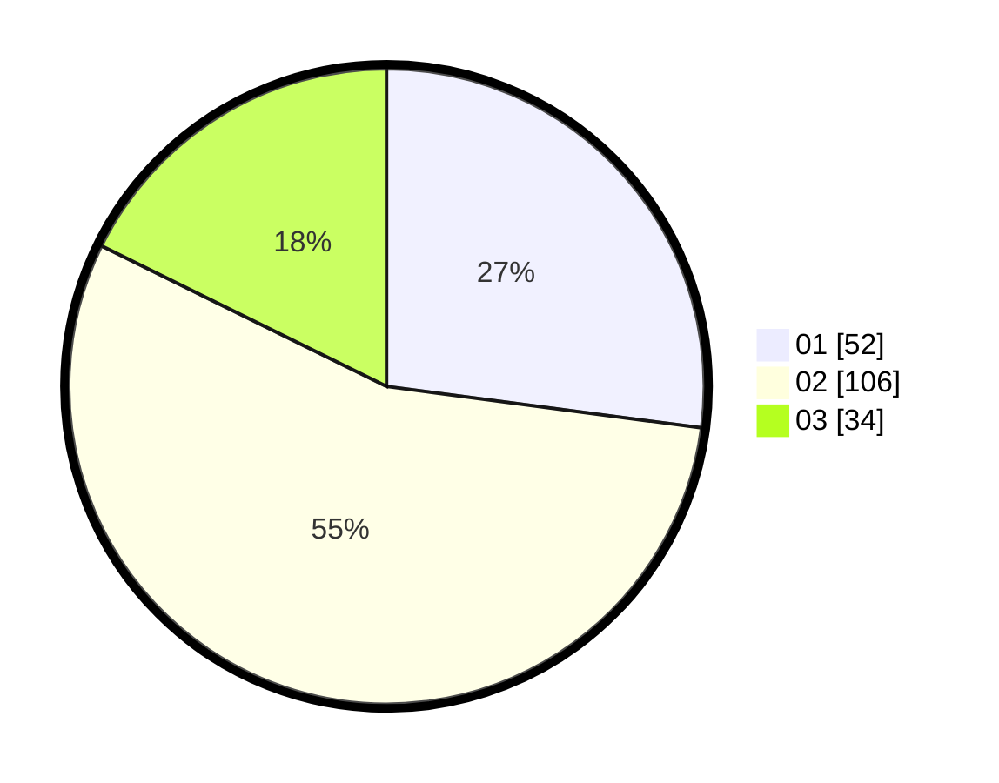

# Hasil

Hasil perolehan suara paslon dapat dilihat pada file paslon-01.txt, paslon-02.txt, dan paslon-03.txt.

Jika tidak ada, artinya data tersebut belum ada pada SIREKAP.

## Perolehan Suara

 * Paslon 01: **52**.
 * Paslon 02: **106**.
 * Paslon 03: **34**.

## Foto C Plano

https://sirekap-obj-formc.kpu.go.id/28f3/pemilu/ppwp/31/73/01/10/03/3173011003138-20240216-061427--14db1d57-8326-429b-8f63-211f369d4067.jpg

https://sirekap-obj-formc.kpu.go.id/28f3/pemilu/ppwp/31/73/01/10/03/3173011003138-20240216-061428--3334d6e1-c8e2-4a65-af59-8ffd8cb72f94.jpg

https://sirekap-obj-formc.kpu.go.id/28f3/pemilu/ppwp/31/73/01/10/03/3173011003138-20240216-061428--5b1f2c5c-1c4d-4eb4-9300-2c653716b0a4.jpg

## DATA PEMILIH TETAP

Jumlah pemilih dalam DPT: **0**.
 * L: **0**.
 * P: **0**.

## DATA PENGGUNA HAK PILIH

Jumlah pengguna hak pilih dalam DPT: **0**.
 * L: **0**.
 * P: **0**.

Jumlah pengguna hak pilih dalam DPTb: **0**.
 * L: **0**.
 * P: **0**.

Jumlah pengguna hak pilih dalam DPK: **0**.
 * L: **0**.
 * P: **0**.

Jumlah pengguna hak pilih: **0**.
 * L: **0**.
 * P: **0**.

## JUMLAH SUARA SAH DAN TIDAK SAH

JUMLAH SELURUH SUARA SAH: **192**.

JUMLAH SUARA TIDAK SAH: **1**.

JUMLAH SELURUH SUARA SAH DAN SUARA TIDAK SAH: **193**.
