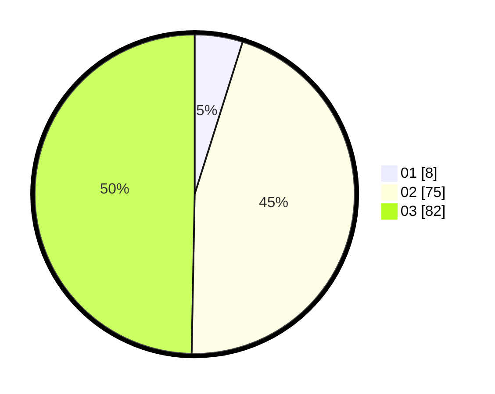

# Hasil

Hasil perolehan suara paslon dapat dilihat pada file paslon-01.txt, paslon-02.txt, dan paslon-03.txt.

Jika tidak ada, artinya data tersebut belum ada pada SIREKAP.

## Perolehan Suara

 * Paslon 01: **8**.
 * Paslon 02: **75**.
 * Paslon 03: **82**.

## Foto C Plano

https://sirekap-obj-formc.kpu.go.id/d3d0/pemilu/ppwp/31/73/01/10/03/3173011003143-20240216-001247--804d9bdc-dc2a-4fe7-9c8c-2da78593df33.jpg

https://sirekap-obj-formc.kpu.go.id/d3d0/pemilu/ppwp/31/73/01/10/03/3173011003143-20240216-001252--9eb9f421-d2d9-4216-be8d-7ab0a5dc6db9.jpg

https://sirekap-obj-formc.kpu.go.id/d3d0/pemilu/ppwp/31/73/01/10/03/3173011003143-20240216-001250--9e0c41bc-9b5f-4980-b873-79b81340fb21.jpg

## DATA PEMILIH TETAP

Jumlah pemilih dalam DPT: **170**.
 * L: **78**.
 * P: **92**.

## DATA PENGGUNA HAK PILIH

Jumlah pengguna hak pilih dalam DPT: **170**.
 * L: **78**.
 * P: **92**.

Jumlah pengguna hak pilih dalam DPTb: **0**.
 * L: **0**.
 * P: **0**.

Jumlah pengguna hak pilih dalam DPK: **0**.
 * L: **0**.
 * P: **0**.

Jumlah pengguna hak pilih: **170**.
 * L: **78**.
 * P: **92**.

## JUMLAH SUARA SAH DAN TIDAK SAH

JUMLAH SELURUH SUARA SAH: **165**.

JUMLAH SUARA TIDAK SAH: **5**.

JUMLAH SELURUH SUARA SAH DAN SUARA TIDAK SAH: **170**.
