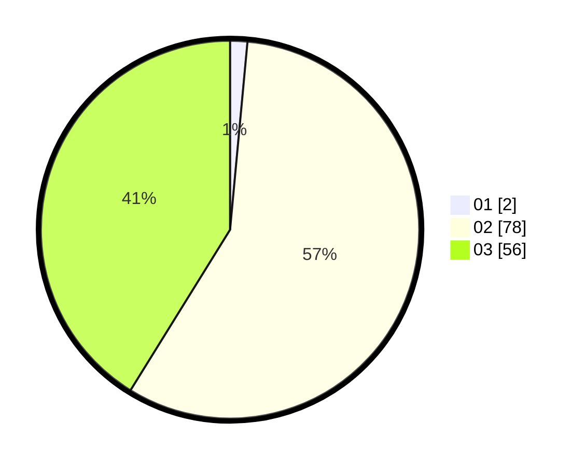

# Hasil

Hasil perolehan suara paslon dapat dilihat pada file paslon-01.txt, paslon-02.txt, dan paslon-03.txt.

Jika tidak ada, artinya data tersebut belum ada pada SIREKAP.

## Perolehan Suara

 * Paslon 01: **2**.
 * Paslon 02: **78**.
 * Paslon 03: **56**.

## Foto C Plano

https://sirekap-obj-formc.kpu.go.id/ce2f/pemilu/ppwp/31/73/01/10/03/3173011003144-20240216-190445--079fca8a-ca5a-4edd-b5d7-c3823cd14c12.jpg

https://sirekap-obj-formc.kpu.go.id/ce2f/pemilu/ppwp/31/73/01/10/03/3173011003144-20240216-190446--d7a4cb8f-fd18-4ef7-a09e-01183973f61a.jpg

https://sirekap-obj-formc.kpu.go.id/ce2f/pemilu/ppwp/31/73/01/10/03/3173011003144-20240216-190446--05fd3555-2382-43fd-9f13-f4ed22b3a96d.jpg

## DATA PEMILIH TETAP

Jumlah pemilih dalam DPT: **163**.
 * L: **78**.
 * P: **85**.

## DATA PENGGUNA HAK PILIH

Jumlah pengguna hak pilih dalam DPT: **135**.
 * L: **59**.
 * P: **76**.

Jumlah pengguna hak pilih dalam DPTb: **1**.
 * L: **0**.
 * P: **1**.

Jumlah pengguna hak pilih dalam DPK: **0**.
 * L: **0**.
 * P: **0**.

Jumlah pengguna hak pilih: **136**.
 * L: **59**.
 * P: **77**.

## JUMLAH SUARA SAH DAN TIDAK SAH

JUMLAH SELURUH SUARA SAH: **136**.

JUMLAH SUARA TIDAK SAH: **0**.

JUMLAH SELURUH SUARA SAH DAN SUARA TIDAK SAH: **136**.
