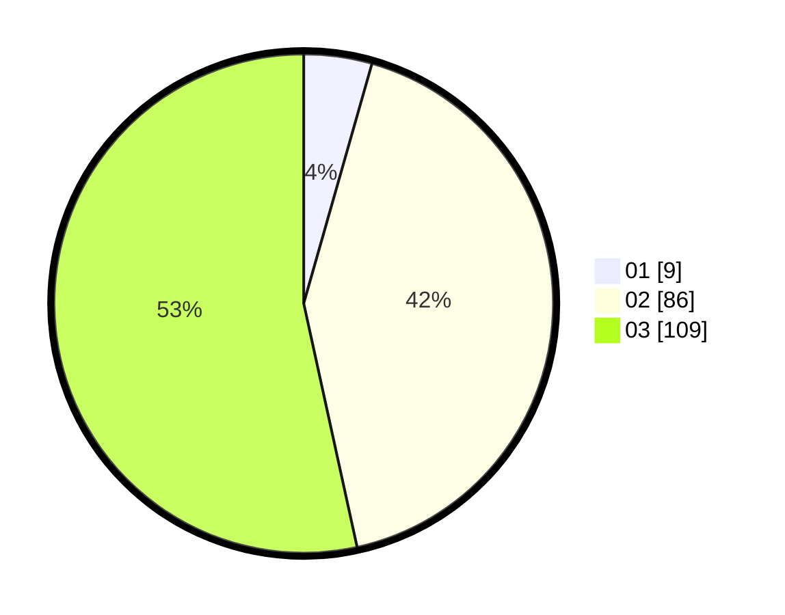

# Hasil

Hasil perolehan suara paslon dapat dilihat pada file paslon-01.txt, paslon-02.txt, dan paslon-03.txt.

Jika tidak ada, artinya data tersebut belum ada pada SIREKAP.

## Perolehan Suara

 * Paslon 01: **9**.
 * Paslon 02: **86**.
 * Paslon 03: **109**.

## Foto C Plano

https://sirekap-obj-formc.kpu.go.id/69dc/pemilu/ppwp/31/73/01/10/03/3173011003147-20240216-001752--5d2cc833-6664-485a-9bb5-b623650254b9.jpg

https://sirekap-obj-formc.kpu.go.id/69dc/pemilu/ppwp/31/73/01/10/03/3173011003147-20240216-001753--c174173b-01c5-4b58-abc0-9cc323750cb0.jpg

https://sirekap-obj-formc.kpu.go.id/69dc/pemilu/ppwp/31/73/01/10/03/3173011003147-20240216-001753--fd94befa-26d2-438f-a422-d5eb195b99de.jpg

## DATA PEMILIH TETAP

Jumlah pemilih dalam DPT: **269**.
 * L: **128**.
 * P: **141**.

## DATA PENGGUNA HAK PILIH

Jumlah pengguna hak pilih dalam DPT: **201**.
 * L: **93**.
 * P: **108**.

Jumlah pengguna hak pilih dalam DPTb: **0**.
 * L: **0**.
 * P: **0**.

Jumlah pengguna hak pilih dalam DPK: **4**.
 * L: **1**.
 * P: **3**.

Jumlah pengguna hak pilih: **205**.
 * L: **94**.
 * P: **111**.

## JUMLAH SUARA SAH DAN TIDAK SAH

JUMLAH SELURUH SUARA SAH: **204**.

JUMLAH SUARA TIDAK SAH: **1**.

JUMLAH SELURUH SUARA SAH DAN SUARA TIDAK SAH: **205**.
