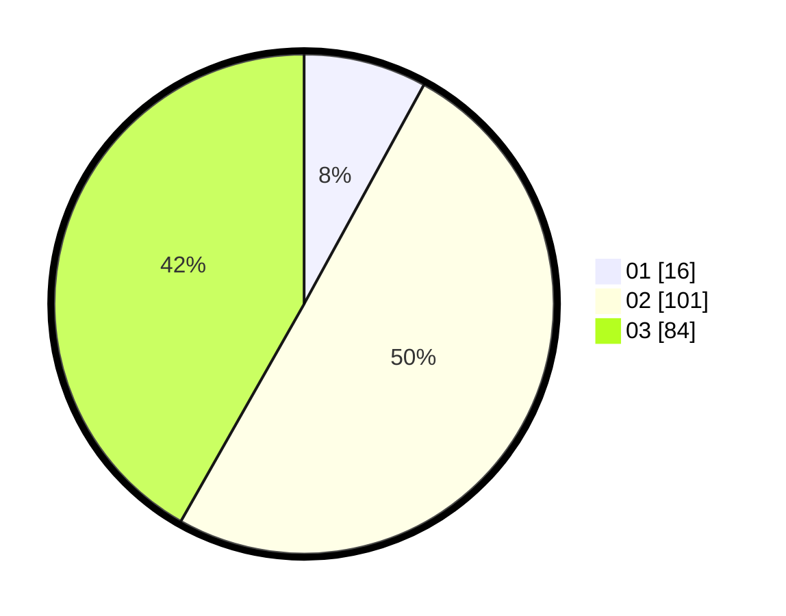

# Hasil

Hasil perolehan suara paslon dapat dilihat pada file paslon-01.txt, paslon-02.txt, dan paslon-03.txt.

Jika tidak ada, artinya data tersebut belum ada pada SIREKAP.

## Perolehan Suara

 * Paslon 01: **16**.
 * Paslon 02: **101**.
 * Paslon 03: **84**.

## Foto C Plano

https://sirekap-obj-formc.kpu.go.id/2ad2/pemilu/ppwp/31/73/01/10/03/3173011003148-20240216-005259--a96a032c-fdd8-4c5e-871c-6a6c7a96ab02.jpg

https://sirekap-obj-formc.kpu.go.id/2ad2/pemilu/ppwp/31/73/01/10/03/3173011003148-20240216-005306--3259839b-ff2a-4942-b6fa-6066be1a98e4.jpg

https://sirekap-obj-formc.kpu.go.id/2ad2/pemilu/ppwp/31/73/01/10/03/3173011003148-20240216-005303--aeb8811e-68fb-4d1f-90a4-04d950a1089d.jpg

## DATA PEMILIH TETAP

Jumlah pemilih dalam DPT: **0**.
 * L: **0**.
 * P: **0**.

## DATA PENGGUNA HAK PILIH

Jumlah pengguna hak pilih dalam DPT: **204**.
 * L: **92**.
 * P: **112**.

Jumlah pengguna hak pilih dalam DPTb: **2**.
 * L: **0**.
 * P: **2**.

Jumlah pengguna hak pilih dalam DPK: **2**.
 * L: **0**.
 * P: **2**.

Jumlah pengguna hak pilih: **208**.
 * L: **92**.
 * P: **116**.

## JUMLAH SUARA SAH DAN TIDAK SAH

JUMLAH SELURUH SUARA SAH: **201**.

JUMLAH SUARA TIDAK SAH: **7**.

JUMLAH SELURUH SUARA SAH DAN SUARA TIDAK SAH: **208**.
