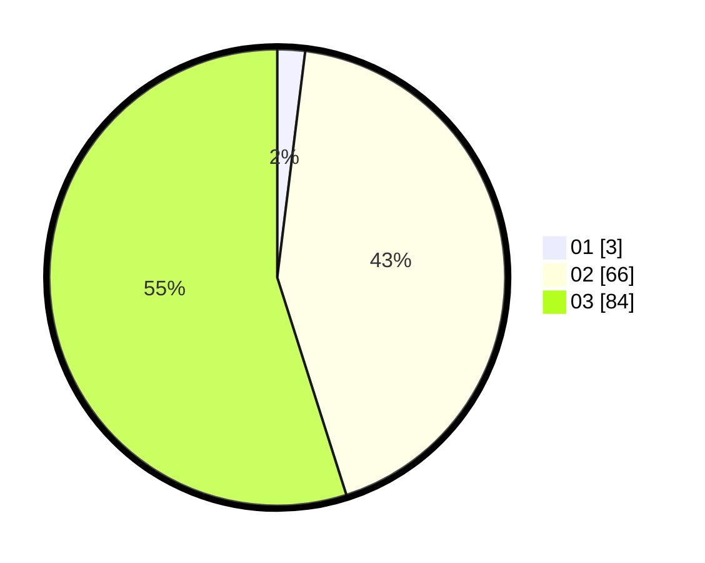

# Hasil

Hasil perolehan suara paslon dapat dilihat pada file paslon-01.txt, paslon-02.txt, dan paslon-03.txt.

Jika tidak ada, artinya data tersebut belum ada pada SIREKAP.

## Perolehan Suara

 * Paslon 01: **3**.
 * Paslon 02: **66**.
 * Paslon 03: **84**.

## Foto C Plano

https://sirekap-obj-formc.kpu.go.id/0004/pemilu/ppwp/31/73/01/10/03/3173011003150-20240214-184701--08a9deda-5350-410d-967e-39440121bb35.jpg

https://sirekap-obj-formc.kpu.go.id/0004/pemilu/ppwp/31/73/01/10/03/3173011003150-20240214-184829--4ea1ef59-4e26-4365-9e2c-a25b66ac56df.jpg

https://sirekap-obj-formc.kpu.go.id/0004/pemilu/ppwp/31/73/01/10/03/3173011003150-20240214-184813--615051f8-2114-48f2-9609-bd6edf02990f.jpg

## DATA PEMILIH TETAP

Jumlah pemilih dalam DPT: **180**.
 * L: **98**.
 * P: **82**.

## DATA PENGGUNA HAK PILIH

Jumlah pengguna hak pilih dalam DPT: **151**.
 * L: **69**.
 * P: **82**.

Jumlah pengguna hak pilih dalam DPTb: **0**.
 * L: **0**.
 * P: **0**.

Jumlah pengguna hak pilih dalam DPK: **3**.
 * L: **1**.
 * P: **2**.

Jumlah pengguna hak pilih: **154**.
 * L: **70**.
 * P: **84**.

## JUMLAH SUARA SAH DAN TIDAK SAH

JUMLAH SELURUH SUARA SAH: **153**.

JUMLAH SUARA TIDAK SAH: **1**.

JUMLAH SELURUH SUARA SAH DAN SUARA TIDAK SAH: **154**.
