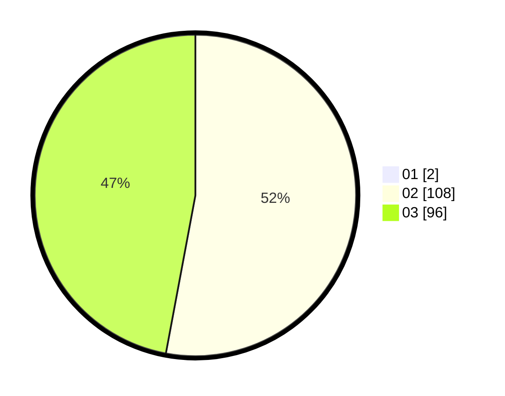

# Hasil

Hasil perolehan suara paslon dapat dilihat pada file paslon-01.txt, paslon-02.txt, dan paslon-03.txt.

Jika tidak ada, artinya data tersebut belum ada pada SIREKAP.

## Perolehan Suara

 * Paslon 01: **2**.
 * Paslon 02: **108**.
 * Paslon 03: **96**.

## Foto C Plano

https://sirekap-obj-formc.kpu.go.id/3391/pemilu/ppwp/31/73/01/10/03/3173011003154-20240216-024200--2d16b315-3523-4fb2-98ff-71a853fe2099.jpg

https://sirekap-obj-formc.kpu.go.id/3391/pemilu/ppwp/31/73/01/10/03/3173011003154-20240216-024201--49dbed73-9034-4bf4-a126-32a01a634709.jpg

https://sirekap-obj-formc.kpu.go.id/3391/pemilu/ppwp/31/73/01/10/03/3173011003154-20240216-024200--2276a629-aadb-47a5-99a0-35fe5186da58.jpg

## DATA PEMILIH TETAP

Jumlah pemilih dalam DPT: **264**.
 * L: **119**.
 * P: **145**.

## DATA PENGGUNA HAK PILIH

Jumlah pengguna hak pilih dalam DPT: **200**.
 * L: **92**.
 * P: **108**.

Jumlah pengguna hak pilih dalam DPTb: **3**.
 * L: **1**.
 * P: **2**.

Jumlah pengguna hak pilih dalam DPK: **4**.
 * L: **0**.
 * P: **4**.

Jumlah pengguna hak pilih: **207**.
 * L: **93**.
 * P: **114**.

## JUMLAH SUARA SAH DAN TIDAK SAH

JUMLAH SELURUH SUARA SAH: **206**.

JUMLAH SUARA TIDAK SAH: **1**.

JUMLAH SELURUH SUARA SAH DAN SUARA TIDAK SAH: **207**.
