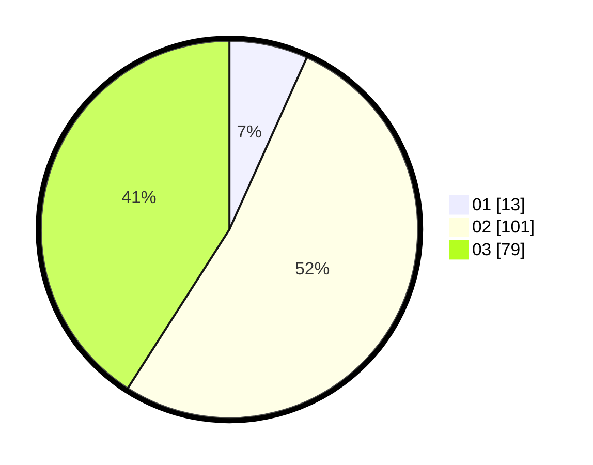

# Hasil

Hasil perolehan suara paslon dapat dilihat pada file paslon-01.txt, paslon-02.txt, dan paslon-03.txt.

Jika tidak ada, artinya data tersebut belum ada pada SIREKAP.

## Perolehan Suara

 * Paslon 01: **13**.
 * Paslon 02: **101**.
 * Paslon 03: **79**.

## Foto C Plano

https://sirekap-obj-formc.kpu.go.id/4468/pemilu/ppwp/31/73/01/10/03/3173011003155-20240215-193106--724086bc-e7fc-4e93-a926-0a690b18b754.jpg

https://sirekap-obj-formc.kpu.go.id/4468/pemilu/ppwp/31/73/01/10/03/3173011003155-20240215-193128--fd9ffd1e-bb11-44c6-9656-3d54ff72173b.jpg

https://sirekap-obj-formc.kpu.go.id/4468/pemilu/ppwp/31/73/01/10/03/3173011003155-20240215-193117--85f33e85-abd5-4ded-91be-493fde11b008.jpg

## DATA PEMILIH TETAP

Jumlah pemilih dalam DPT: **264**.
 * L: **122**.
 * P: **142**.

## DATA PENGGUNA HAK PILIH

Jumlah pengguna hak pilih dalam DPT: **195**.
 * L: **92**.
 * P: **103**.

Jumlah pengguna hak pilih dalam DPTb: **4**.
 * L: **0**.
 * P: **4**.

Jumlah pengguna hak pilih dalam DPK: **0**.
 * L: **0**.
 * P: **0**.

Jumlah pengguna hak pilih: **0**.
 * L: **0**.
 * P: **0**.

## JUMLAH SUARA SAH DAN TIDAK SAH

JUMLAH SELURUH SUARA SAH: **193**.

JUMLAH SUARA TIDAK SAH: **6**.

JUMLAH SELURUH SUARA SAH DAN SUARA TIDAK SAH: **199**.
