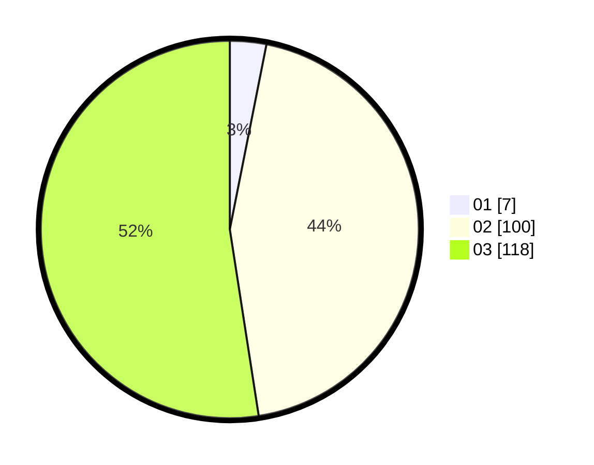

# Hasil

Hasil perolehan suara paslon dapat dilihat pada file paslon-01.txt, paslon-02.txt, dan paslon-03.txt.

Jika tidak ada, artinya data tersebut belum ada pada SIREKAP.

## Perolehan Suara

 * Paslon 01: **7**.
 * Paslon 02: **100**.
 * Paslon 03: **118**.

## Foto C Plano

https://sirekap-obj-formc.kpu.go.id/5ddf/pemilu/ppwp/31/73/01/10/03/3173011003159-20240215-220432--ec5ff668-aba2-4165-9ece-e200337a234f.jpg

https://sirekap-obj-formc.kpu.go.id/5ddf/pemilu/ppwp/31/73/01/10/03/3173011003159-20240215-220435--1b454ab9-a18d-42cf-83b5-7e4ce434e765.jpg

https://sirekap-obj-formc.kpu.go.id/5ddf/pemilu/ppwp/31/73/01/10/03/3173011003159-20240215-220433--c6a9cf99-98f7-4997-82ed-fe1e6b24afc9.jpg

## DATA PEMILIH TETAP

Jumlah pemilih dalam DPT: **268**.
 * L: **119**.
 * P: **149**.

## DATA PENGGUNA HAK PILIH

Jumlah pengguna hak pilih dalam DPT: **223**.
 * L: **97**.
 * P: **126**.

Jumlah pengguna hak pilih dalam DPTb: **2**.
 * L: **0**.
 * P: **2**.

Jumlah pengguna hak pilih dalam DPK: **0**.
 * L: **0**.
 * P: **0**.

Jumlah pengguna hak pilih: **225**.
 * L: **97**.
 * P: **128**.

## JUMLAH SUARA SAH DAN TIDAK SAH

JUMLAH SELURUH SUARA SAH: **225**.

JUMLAH SUARA TIDAK SAH: **0**.

JUMLAH SELURUH SUARA SAH DAN SUARA TIDAK SAH: **225**.
