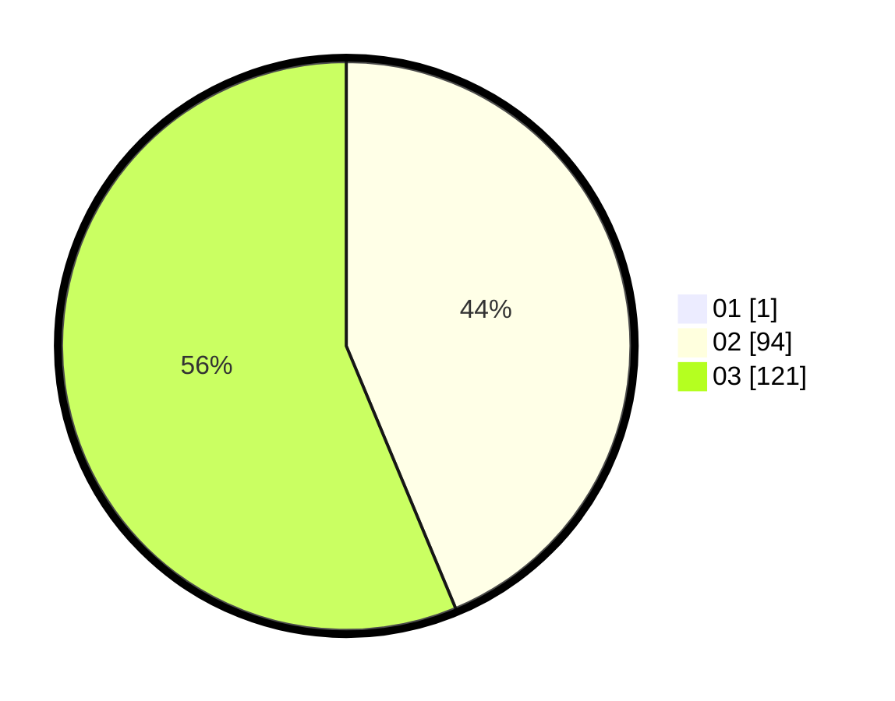

# Hasil

Hasil perolehan suara paslon dapat dilihat pada file paslon-01.txt, paslon-02.txt, dan paslon-03.txt.

Jika tidak ada, artinya data tersebut belum ada pada SIREKAP.

## Perolehan Suara

 * Paslon 01: **1**.
 * Paslon 02: **94**.
 * Paslon 03: **121**.

## Foto C Plano

https://sirekap-obj-formc.kpu.go.id/52e6/pemilu/ppwp/31/73/01/10/03/3173011003164-20240215-222514--5239e88d-2251-49bc-81e8-f1b4454ad9eb.jpg

https://sirekap-obj-formc.kpu.go.id/52e6/pemilu/ppwp/31/73/01/10/03/3173011003164-20240215-222517--67729b9a-2473-4070-847f-f62ad74cca1b.jpg

https://sirekap-obj-formc.kpu.go.id/52e6/pemilu/ppwp/31/73/01/10/03/3173011003164-20240215-222516--2a81f65e-94de-477d-8f27-618af70ce9d0.jpg

## DATA PEMILIH TETAP

Jumlah pemilih dalam DPT: **274**.
 * L: **131**.
 * P: **143**.

## DATA PENGGUNA HAK PILIH

Jumlah pengguna hak pilih dalam DPT: **215**.
 * L: **94**.
 * P: **121**.

Jumlah pengguna hak pilih dalam DPTb: **3**.
 * L: **0**.
 * P: **3**.

Jumlah pengguna hak pilih dalam DPK: **3**.
 * L: **1**.
 * P: **2**.

Jumlah pengguna hak pilih: **221**.
 * L: **95**.
 * P: **126**.

## JUMLAH SUARA SAH DAN TIDAK SAH

JUMLAH SELURUH SUARA SAH: **216**.

JUMLAH SUARA TIDAK SAH: **5**.

JUMLAH SELURUH SUARA SAH DAN SUARA TIDAK SAH: **221**.
