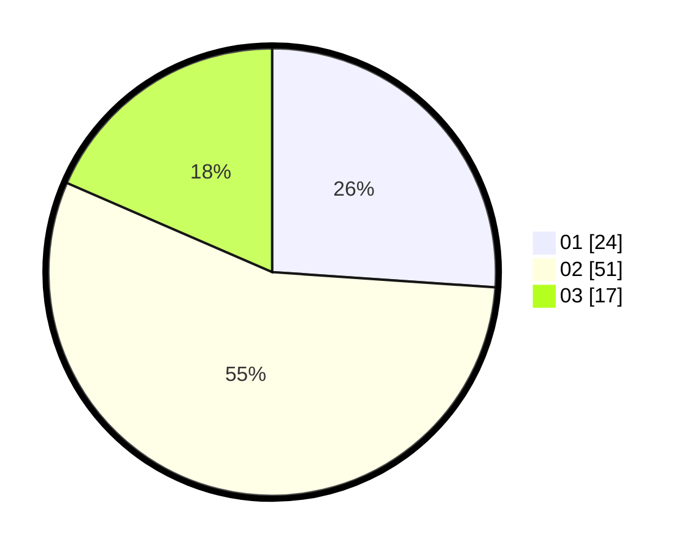

# Hasil

Hasil perolehan suara paslon dapat dilihat pada file paslon-01.txt, paslon-02.txt, dan paslon-03.txt.

Jika tidak ada, artinya data tersebut belum ada pada SIREKAP.

## Perolehan Suara

 * Paslon 01: **24**.
 * Paslon 02: **51**.
 * Paslon 03: **17**.

## Foto C Plano

https://sirekap-obj-formc.kpu.go.id/f29c/pemilu/ppwp/31/73/01/10/03/3173011003170-20240216-124234--da22c6aa-8929-4360-bf59-34ac86f52de5.jpg

https://sirekap-obj-formc.kpu.go.id/f29c/pemilu/ppwp/31/73/01/10/03/3173011003170-20240216-124236--8ca74436-d6ec-47d2-ab9c-865471e10064.jpg

https://sirekap-obj-formc.kpu.go.id/f29c/pemilu/ppwp/31/73/01/10/03/3173011003170-20240216-124235--a1399c12-6d65-496c-aad3-e7cbfa9e06b9.jpg

## DATA PEMILIH TETAP

Jumlah pemilih dalam DPT: **110**.
 * L: **52**.
 * P: **58**.

## DATA PENGGUNA HAK PILIH

Jumlah pengguna hak pilih dalam DPT: **94**.
 * L: **43**.
 * P: **51**.

Jumlah pengguna hak pilih dalam DPTb: **0**.
 * L: **0**.
 * P: **0**.

Jumlah pengguna hak pilih dalam DPK: **0**.
 * L: **0**.
 * P: **0**.

Jumlah pengguna hak pilih: **94**.
 * L: **43**.
 * P: **51**.

## JUMLAH SUARA SAH DAN TIDAK SAH

JUMLAH SELURUH SUARA SAH: **92**.

JUMLAH SUARA TIDAK SAH: **2**.

JUMLAH SELURUH SUARA SAH DAN SUARA TIDAK SAH: **94**.
