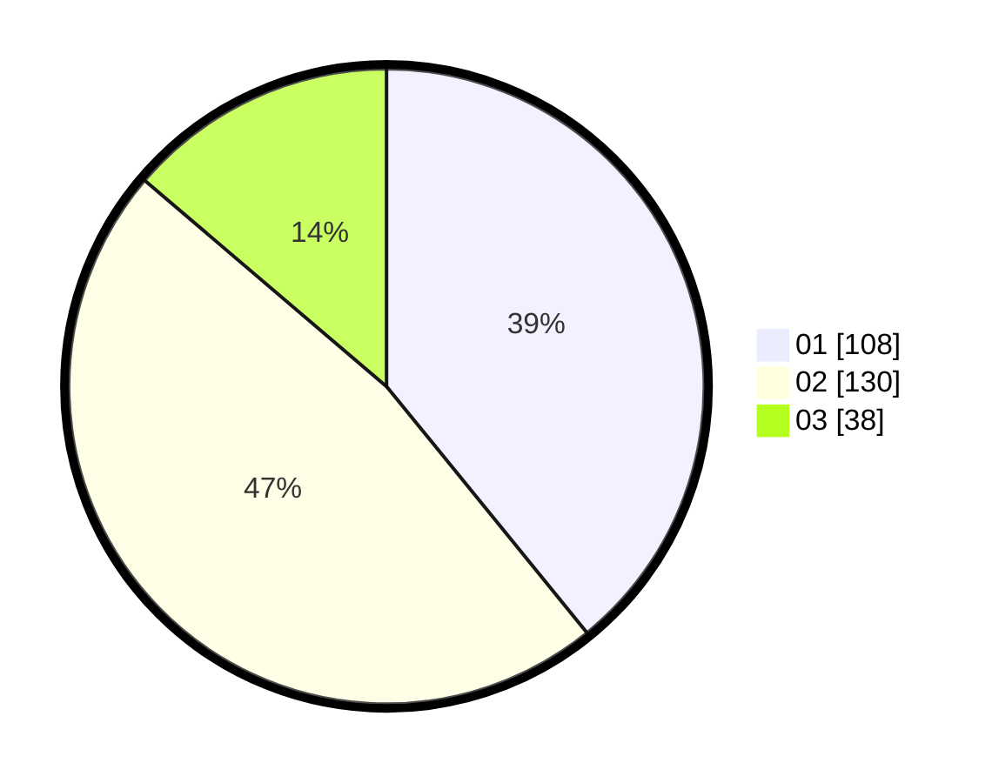

# Hasil

Hasil perolehan suara paslon dapat dilihat pada file paslon-01.txt, paslon-02.txt, dan paslon-03.txt.

Jika tidak ada, artinya data tersebut belum ada pada SIREKAP.

## Perolehan Suara

 * Paslon 01: **108**.
 * Paslon 02: **130**.
 * Paslon 03: **38**.

## Foto C Plano

https://sirekap-obj-formc.kpu.go.id/4c9a/pemilu/ppwp/31/73/01/10/03/3173011003172-20240216-141655--877ec37e-c5b0-4f70-9b08-a497c2b32482.jpg

https://sirekap-obj-formc.kpu.go.id/4c9a/pemilu/ppwp/31/73/01/10/03/3173011003172-20240216-141656--9e4da04c-6b28-4759-93cb-8de239d33f28.jpg

https://sirekap-obj-formc.kpu.go.id/4c9a/pemilu/ppwp/31/73/01/10/03/3173011003172-20240216-141656--6e190005-27ea-4c0d-a789-a40c9beb0b5b.jpg

## DATA PEMILIH TETAP

Jumlah pemilih dalam DPT: **289**.
 * L: **150**.
 * P: **139**.

## DATA PENGGUNA HAK PILIH

Jumlah pengguna hak pilih dalam DPT: **270**.
 * L: **135**.
 * P: **135**.

Jumlah pengguna hak pilih dalam DPTb: **0**.
 * L: **0**.
 * P: **0**.

Jumlah pengguna hak pilih dalam DPK: **7**.
 * L: **5**.
 * P: **2**.

Jumlah pengguna hak pilih: **277**.
 * L: **140**.
 * P: **137**.

## JUMLAH SUARA SAH DAN TIDAK SAH

JUMLAH SELURUH SUARA SAH: **276**.

JUMLAH SUARA TIDAK SAH: **1**.

JUMLAH SELURUH SUARA SAH DAN SUARA TIDAK SAH: **277**.
