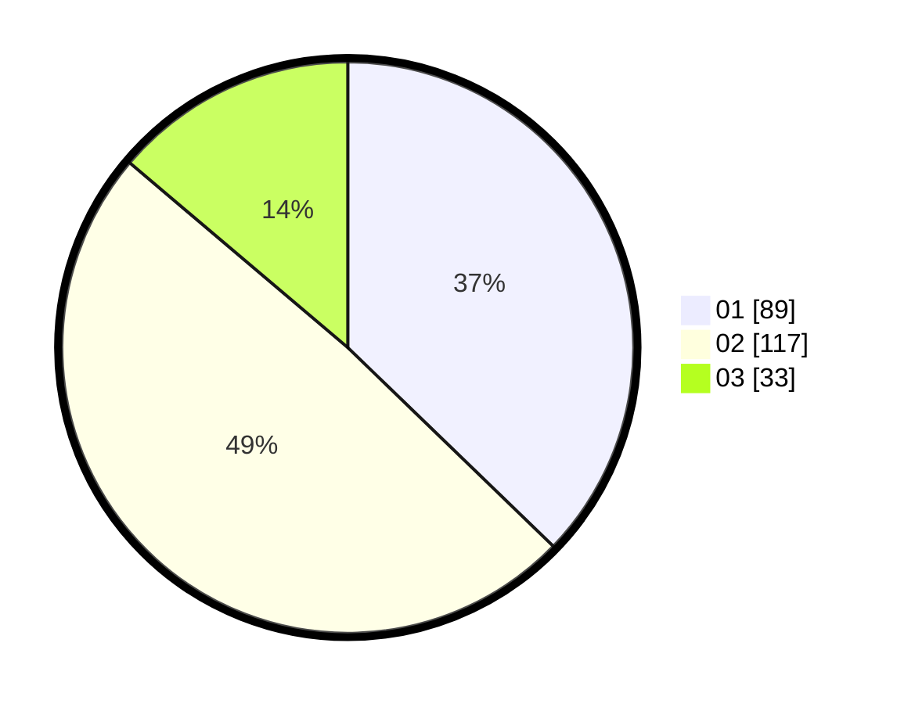

# Hasil

Hasil perolehan suara paslon dapat dilihat pada file paslon-01.txt, paslon-02.txt, dan paslon-03.txt.

Jika tidak ada, artinya data tersebut belum ada pada SIREKAP.

## Perolehan Suara

 * Paslon 01: **89**.
 * Paslon 02: **117**.
 * Paslon 03: **33**.

## Foto C Plano

https://sirekap-obj-formc.kpu.go.id/53e8/pemilu/ppwp/31/73/01/10/03/3173011003177-20240214-192551--1f83881d-b7a4-44db-8577-081b7f7e80f3.jpg

https://sirekap-obj-formc.kpu.go.id/53e8/pemilu/ppwp/31/73/01/10/03/3173011003177-20240214-201429--1207c793-9074-4774-b265-a13a9e11e5cf.jpg

https://sirekap-obj-formc.kpu.go.id/53e8/pemilu/ppwp/31/73/01/10/03/3173011003177-20240214-192851--cd5930a9-f645-4dfc-9088-2fa0a878c0a0.jpg

## DATA PEMILIH TETAP

Jumlah pemilih dalam DPT: **296**.
 * L: **149**.
 * P: **147**.

## DATA PENGGUNA HAK PILIH

Jumlah pengguna hak pilih dalam DPT: **242**.
 * L: **118**.
 * P: **124**.

Jumlah pengguna hak pilih dalam DPTb: **0**.
 * L: **0**.
 * P: **0**.

Jumlah pengguna hak pilih dalam DPK: **5**.
 * L: **1**.
 * P: **4**.

Jumlah pengguna hak pilih: **247**.
 * L: **119**.
 * P: **128**.

## JUMLAH SUARA SAH DAN TIDAK SAH

JUMLAH SELURUH SUARA SAH: **239**.

JUMLAH SUARA TIDAK SAH: **8**.

JUMLAH SELURUH SUARA SAH DAN SUARA TIDAK SAH: **247**.
