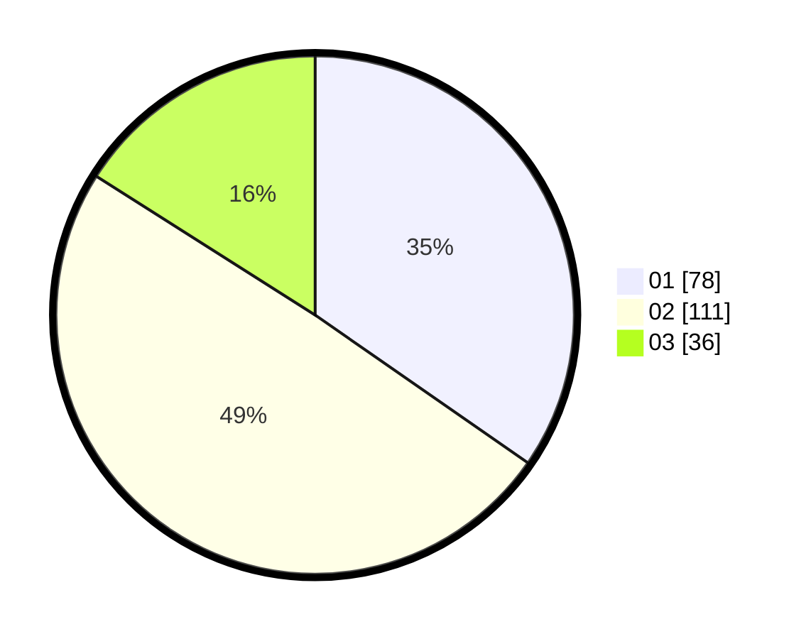

# Hasil

Hasil perolehan suara paslon dapat dilihat pada file paslon-01.txt, paslon-02.txt, dan paslon-03.txt.

Jika tidak ada, artinya data tersebut belum ada pada SIREKAP.

## Perolehan Suara

 * Paslon 01: **78**.
 * Paslon 02: **111**.
 * Paslon 03: **36**.

## Foto C Plano

https://sirekap-obj-formc.kpu.go.id/93e1/pemilu/ppwp/31/73/01/10/03/3173011003179-20240215-002637--94f76fd2-b533-47f8-a358-79ccf2f82249.jpg

https://sirekap-obj-formc.kpu.go.id/93e1/pemilu/ppwp/31/73/01/10/03/3173011003179-20240214-215143--a13b18f1-c957-49d4-bc55-112d70bddb8f.jpg

https://sirekap-obj-formc.kpu.go.id/93e1/pemilu/ppwp/31/73/01/10/03/3173011003179-20240214-215239--784d079d-5dc9-4c13-9141-d171cddeb83a.jpg

## DATA PEMILIH TETAP

Jumlah pemilih dalam DPT: **289**.
 * L: **140**.
 * P: **149**.

## DATA PENGGUNA HAK PILIH

Jumlah pengguna hak pilih dalam DPT: **235**.
 * L: **108**.
 * P: **127**.

Jumlah pengguna hak pilih dalam DPTb: **0**.
 * L: **0**.
 * P: **0**.

Jumlah pengguna hak pilih dalam DPK: **1**.
 * L: **0**.
 * P: **1**.

Jumlah pengguna hak pilih: **236**.
 * L: **108**.
 * P: **128**.

## JUMLAH SUARA SAH DAN TIDAK SAH

JUMLAH SELURUH SUARA SAH: **225**.

JUMLAH SUARA TIDAK SAH: **11**.

JUMLAH SELURUH SUARA SAH DAN SUARA TIDAK SAH: **236**.
