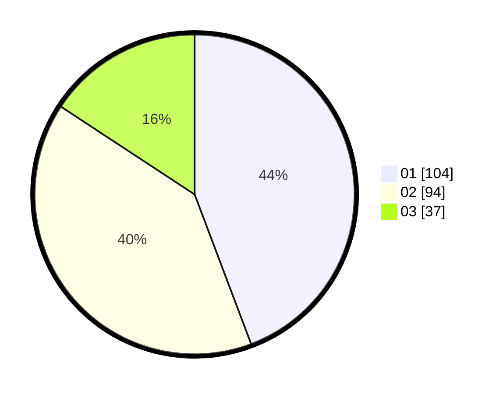

# Hasil

Hasil perolehan suara paslon dapat dilihat pada file paslon-01.txt, paslon-02.txt, dan paslon-03.txt.

Jika tidak ada, artinya data tersebut belum ada pada SIREKAP.

## Perolehan Suara

 * Paslon 01: **104**.
 * Paslon 02: **94**.
 * Paslon 03: **37**.

## Foto C Plano

https://sirekap-obj-formc.kpu.go.id/ecf4/pemilu/ppwp/31/73/01/10/03/3173011003180-20240216-014927--20577543-14b5-4f89-8c02-18a29a6c59ac.jpg

https://sirekap-obj-formc.kpu.go.id/ecf4/pemilu/ppwp/31/73/01/10/03/3173011003180-20240216-014930--e419985c-b523-4e0b-8a67-679f89524f0b.jpg

https://sirekap-obj-formc.kpu.go.id/ecf4/pemilu/ppwp/31/73/01/10/03/3173011003180-20240216-014928--cf950260-ff72-42bb-8808-bfbfe93d040b.jpg

## DATA PEMILIH TETAP

Jumlah pemilih dalam DPT: **291**.
 * L: **155**.
 * P: **136**.

## DATA PENGGUNA HAK PILIH

Jumlah pengguna hak pilih dalam DPT: **234**.
 * L: **126**.
 * P: **108**.

Jumlah pengguna hak pilih dalam DPTb: **0**.
 * L: **0**.
 * P: **0**.

Jumlah pengguna hak pilih dalam DPK: **2**.
 * L: **0**.
 * P: **2**.

Jumlah pengguna hak pilih: **236**.
 * L: **126**.
 * P: **110**.

## JUMLAH SUARA SAH DAN TIDAK SAH

JUMLAH SELURUH SUARA SAH: **235**.

JUMLAH SUARA TIDAK SAH: **1**.

JUMLAH SELURUH SUARA SAH DAN SUARA TIDAK SAH: **236**.
