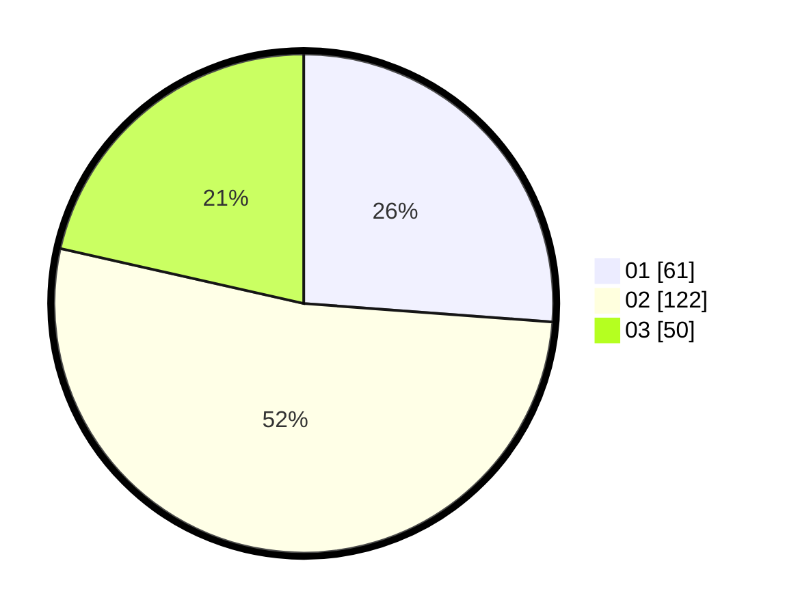

# Hasil

Hasil perolehan suara paslon dapat dilihat pada file paslon-01.txt, paslon-02.txt, dan paslon-03.txt.

Jika tidak ada, artinya data tersebut belum ada pada SIREKAP.

## Perolehan Suara

 * Paslon 01: **61**.
 * Paslon 02: **122**.
 * Paslon 03: **50**.

## Foto C Plano

https://sirekap-obj-formc.kpu.go.id/13c4/pemilu/ppwp/31/73/01/10/03/3173011003181-20240216-145010--3c97fc05-545c-4af5-8984-8cda44ab4857.jpg

https://sirekap-obj-formc.kpu.go.id/13c4/pemilu/ppwp/31/73/01/10/03/3173011003181-20240216-145011--4c3984b2-14e0-4b88-bcde-fc72c71f08f3.jpg

https://sirekap-obj-formc.kpu.go.id/13c4/pemilu/ppwp/31/73/01/10/03/3173011003181-20240216-145010--d52423d7-c71b-409c-83c0-d4c4bfb86f4b.jpg

## DATA PEMILIH TETAP

Jumlah pemilih dalam DPT: **286**.
 * L: **141**.
 * P: **145**.

## DATA PENGGUNA HAK PILIH

Jumlah pengguna hak pilih dalam DPT: **234**.
 * L: **109**.
 * P: **125**.

Jumlah pengguna hak pilih dalam DPTb: **0**.
 * L: **0**.
 * P: **0**.

Jumlah pengguna hak pilih dalam DPK: **0**.
 * L: **0**.
 * P: **0**.

Jumlah pengguna hak pilih: **234**.
 * L: **109**.
 * P: **125**.

## JUMLAH SUARA SAH DAN TIDAK SAH

JUMLAH SELURUH SUARA SAH: **233**.

JUMLAH SUARA TIDAK SAH: **1**.

JUMLAH SELURUH SUARA SAH DAN SUARA TIDAK SAH: **234**.
