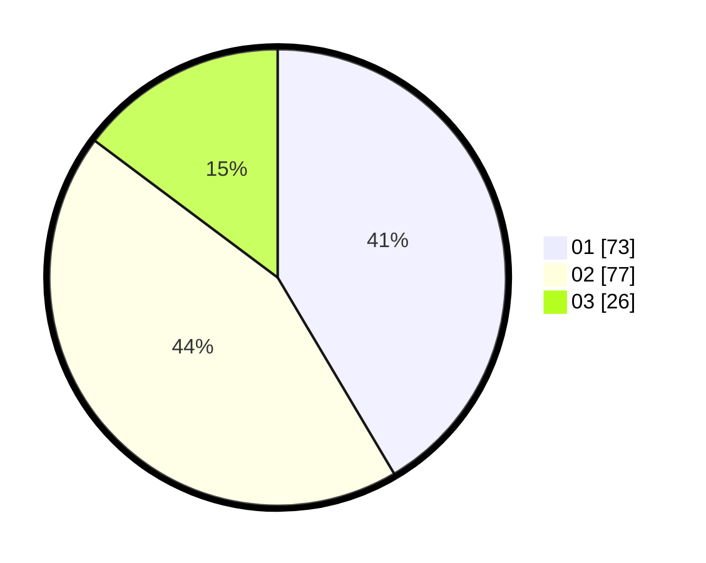

# Hasil

Hasil perolehan suara paslon dapat dilihat pada file paslon-01.txt, paslon-02.txt, dan paslon-03.txt.

Jika tidak ada, artinya data tersebut belum ada pada SIREKAP.

## Perolehan Suara

 * Paslon 01: **73**.
 * Paslon 02: **77**.
 * Paslon 03: **26**.

## Foto C Plano

https://sirekap-obj-formc.kpu.go.id/2b41/pemilu/ppwp/31/73/01/10/03/3173011003182-20240217-091254--a7127e47-1ae7-48b2-a448-1b648cb880c5.jpg

https://sirekap-obj-formc.kpu.go.id/2b41/pemilu/ppwp/31/73/01/10/03/3173011003182-20240217-091255--f8f7d47e-ddc0-4e33-9cb2-4391d52539b9.jpg

https://sirekap-obj-formc.kpu.go.id/2b41/pemilu/ppwp/31/73/01/10/03/3173011003182-20240217-091254--e07c3a37-ea7d-491b-b0e8-abf54db52224.jpg

## DATA PEMILIH TETAP

Jumlah pemilih dalam DPT: **212**.
 * L: **106**.
 * P: **106**.

## DATA PENGGUNA HAK PILIH

Jumlah pengguna hak pilih dalam DPT: **179**.
 * L: **89**.
 * P: **90**.

Jumlah pengguna hak pilih dalam DPTb: **0**.
 * L: **0**.
 * P: **0**.

Jumlah pengguna hak pilih dalam DPK: **0**.
 * L: **0**.
 * P: **0**.

Jumlah pengguna hak pilih: **179**.
 * L: **89**.
 * P: **90**.

## JUMLAH SUARA SAH DAN TIDAK SAH

JUMLAH SELURUH SUARA SAH: **176**.

JUMLAH SUARA TIDAK SAH: **3**.

JUMLAH SELURUH SUARA SAH DAN SUARA TIDAK SAH: **179**.
