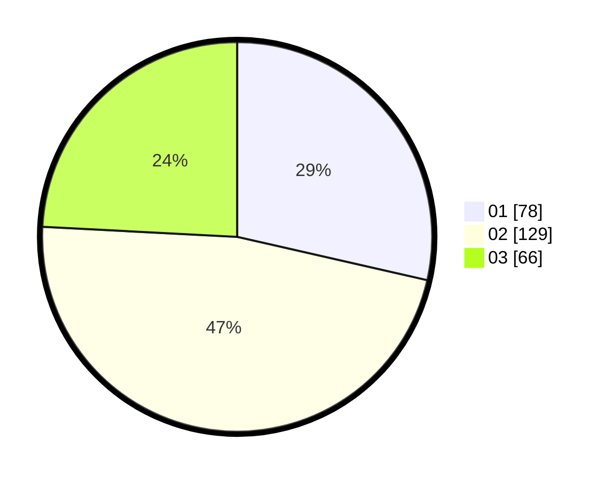

# Hasil

Hasil perolehan suara paslon dapat dilihat pada file paslon-01.txt, paslon-02.txt, dan paslon-03.txt.

Jika tidak ada, artinya data tersebut belum ada pada SIREKAP.

## Perolehan Suara

 * Paslon 01: **78**.
 * Paslon 02: **129**.
 * Paslon 03: **66**.

## Foto C Plano

https://sirekap-obj-formc.kpu.go.id/9d02/pemilu/ppwp/31/73/01/10/03/3173011003185-20240214-231555--9928eafa-20ae-4f7e-8097-716cc9b6ffd0.jpg

https://sirekap-obj-formc.kpu.go.id/9d02/pemilu/ppwp/31/73/01/10/03/3173011003185-20240214-231616--d569d91e-5f63-4482-ae9b-827c787c47ec.jpg

https://sirekap-obj-formc.kpu.go.id/9d02/pemilu/ppwp/31/73/01/10/03/3173011003185-20240214-231633--c3f40ce7-1f0f-43bf-b5d3-9b21ba66c5f6.jpg
