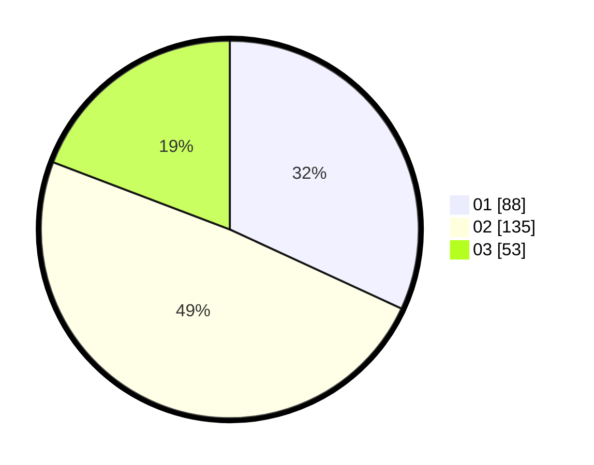

# Hasil

Hasil perolehan suara paslon dapat dilihat pada file paslon-01.txt, paslon-02.txt, dan paslon-03.txt.

Jika tidak ada, artinya data tersebut belum ada pada SIREKAP.

## Perolehan Suara

 * Paslon 01: **88**.
 * Paslon 02: **135**.
 * Paslon 03: **53**.

## Foto C Plano

https://sirekap-obj-formc.kpu.go.id/cdcc/pemilu/ppwp/31/73/01/10/03/3173011003186-20240214-234038--c82abf19-687f-4190-aaca-cbb3653c0170.jpg

https://sirekap-obj-formc.kpu.go.id/cdcc/pemilu/ppwp/31/73/01/10/03/3173011003186-20240214-234052--ac5a8ad9-886e-4892-a822-2f4cc29d8166.jpg

https://sirekap-obj-formc.kpu.go.id/cdcc/pemilu/ppwp/31/73/01/10/03/3173011003186-20240214-234108--944adb2d-0bda-4b38-82d5-e5d2259b6bf4.jpg
