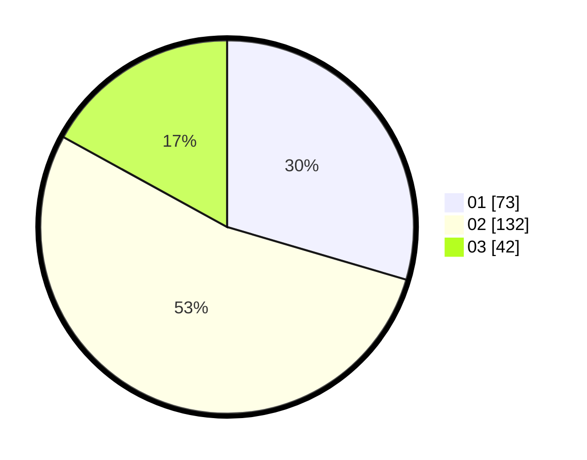

# Hasil

Hasil perolehan suara paslon dapat dilihat pada file paslon-01.txt, paslon-02.txt, dan paslon-03.txt.

Jika tidak ada, artinya data tersebut belum ada pada SIREKAP.

## Perolehan Suara

 * Paslon 01: **73**.
 * Paslon 02: **132**.
 * Paslon 03: **42**.

## Foto C Plano

https://sirekap-obj-formc.kpu.go.id/09d9/pemilu/ppwp/31/73/01/10/03/3173011003191-20240216-030520--fb51d00e-9dde-4868-877d-2e20282e36bd.jpg

https://sirekap-obj-formc.kpu.go.id/09d9/pemilu/ppwp/31/73/01/10/03/3173011003191-20240216-030521--ec292fdb-e766-4d26-91a5-276ea9e9c2a3.jpg

https://sirekap-obj-formc.kpu.go.id/09d9/pemilu/ppwp/31/73/01/10/03/3173011003191-20240216-030520--077f8ca1-ade0-422f-8f84-c4f7b2eb9220.jpg

## DATA PEMILIH TETAP

Jumlah pemilih dalam DPT: **289**.
 * L: **148**.
 * P: **141**.

## DATA PENGGUNA HAK PILIH

Jumlah pengguna hak pilih dalam DPT: **245**.
 * L: **131**.
 * P: **114**.

Jumlah pengguna hak pilih dalam DPTb: **4**.
 * L: **1**.
 * P: **3**.

Jumlah pengguna hak pilih dalam DPK: **1**.
 * L: **0**.
 * P: **1**.

Jumlah pengguna hak pilih: **250**.
 * L: **132**.
 * P: **118**.

## JUMLAH SUARA SAH DAN TIDAK SAH

JUMLAH SELURUH SUARA SAH: **247**.

JUMLAH SUARA TIDAK SAH: **3**.

JUMLAH SELURUH SUARA SAH DAN SUARA TIDAK SAH: **250**.
