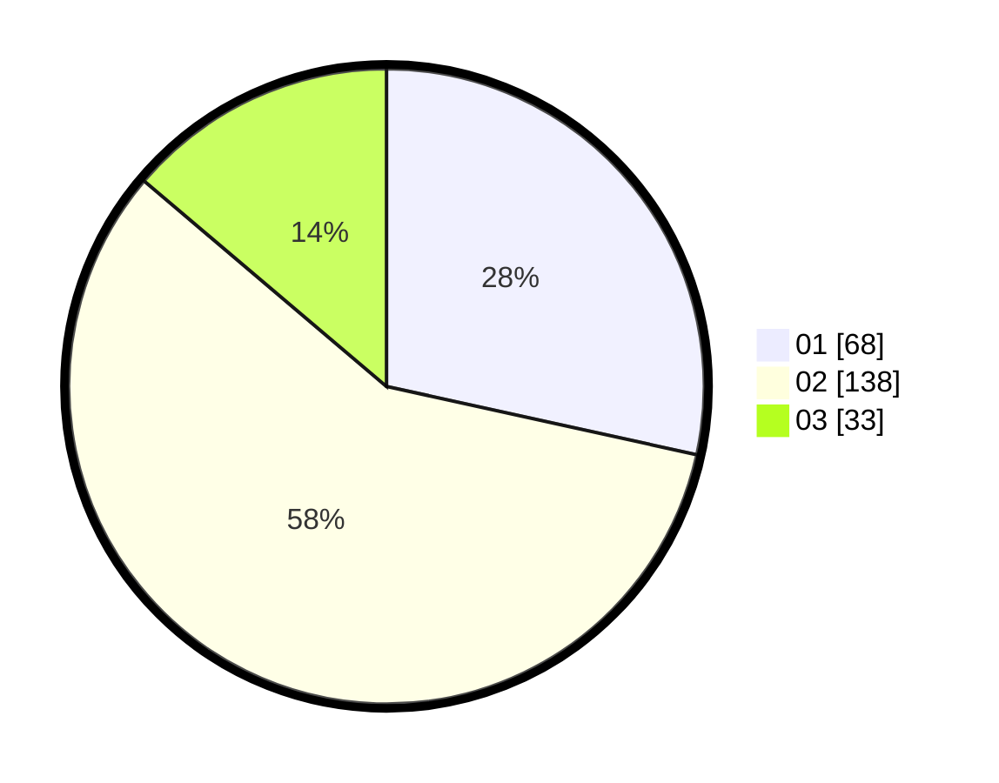

# Hasil

Hasil perolehan suara paslon dapat dilihat pada file paslon-01.txt, paslon-02.txt, dan paslon-03.txt.

Jika tidak ada, artinya data tersebut belum ada pada SIREKAP.

## Perolehan Suara

 * Paslon 01: **68**.
 * Paslon 02: **138**.
 * Paslon 03: **33**.

## Foto C Plano

https://sirekap-obj-formc.kpu.go.id/cb01/pemilu/ppwp/31/73/01/10/03/3173011003194-20240215-003802--26b5a01e-e227-4c56-8308-8d3445a85005.jpg

https://sirekap-obj-formc.kpu.go.id/cb01/pemilu/ppwp/31/73/01/10/03/3173011003194-20240214-222137--1ca0fe03-5b62-4aa8-8551-39ddd3d1207c.jpg

https://sirekap-obj-formc.kpu.go.id/cb01/pemilu/ppwp/31/73/01/10/03/3173011003194-20240214-222212--e703b8a3-8d26-43ea-9485-4b7d087eee1a.jpg
