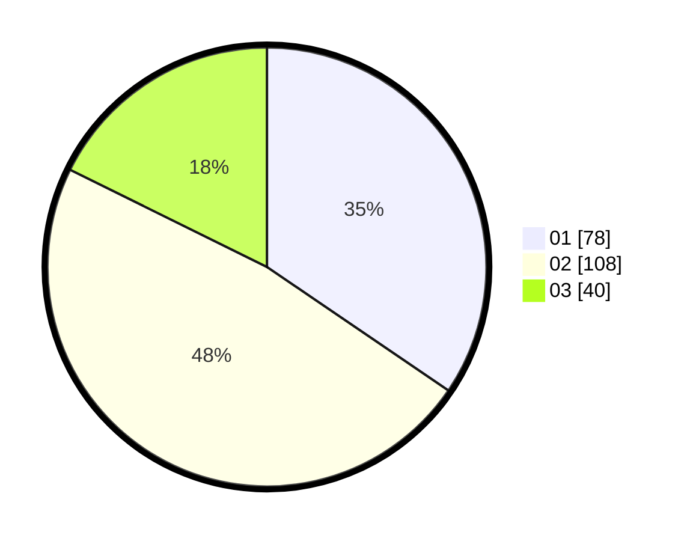

# Hasil

Hasil perolehan suara paslon dapat dilihat pada file paslon-01.txt, paslon-02.txt, dan paslon-03.txt.

Jika tidak ada, artinya data tersebut belum ada pada SIREKAP.

## Perolehan Suara

 * Paslon 01: **78**.
 * Paslon 02: **108**.
 * Paslon 03: **40**.

## Foto C Plano

https://sirekap-obj-formc.kpu.go.id/5d0a/pemilu/ppwp/31/73/01/10/03/3173011003196-20240216-133337--f5656726-1891-4500-995e-31f480c5a853.jpg

https://sirekap-obj-formc.kpu.go.id/5d0a/pemilu/ppwp/31/73/01/10/03/3173011003196-20240216-133339--69ecab89-34a4-4ef4-8274-e735bea47b53.jpg

https://sirekap-obj-formc.kpu.go.id/5d0a/pemilu/ppwp/31/73/01/10/03/3173011003196-20240216-133338--315a483c-5f65-4a92-9088-40c29d187e14.jpg

## DATA PEMILIH TETAP

Jumlah pemilih dalam DPT: **290**.
 * L: **134**.
 * P: **156**.

## DATA PENGGUNA HAK PILIH

Jumlah pengguna hak pilih dalam DPT: **224**.
 * L: **104**.
 * P: **120**.

Jumlah pengguna hak pilih dalam DPTb: **0**.
 * L: **0**.
 * P: **0**.

Jumlah pengguna hak pilih dalam DPK: **3**.
 * L: **2**.
 * P: **1**.

Jumlah pengguna hak pilih: **227**.
 * L: **106**.
 * P: **121**.

## JUMLAH SUARA SAH DAN TIDAK SAH

JUMLAH SELURUH SUARA SAH: **226**.

JUMLAH SUARA TIDAK SAH: **1**.

JUMLAH SELURUH SUARA SAH DAN SUARA TIDAK SAH: **227**.
