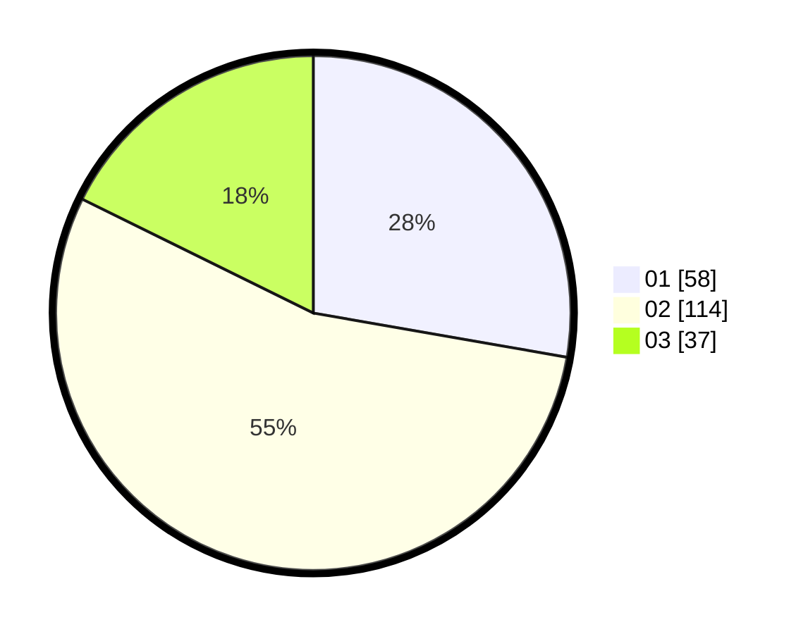

# Hasil

Hasil perolehan suara paslon dapat dilihat pada file paslon-01.txt, paslon-02.txt, dan paslon-03.txt.

Jika tidak ada, artinya data tersebut belum ada pada SIREKAP.

## Perolehan Suara

 * Paslon 01: **58**.
 * Paslon 02: **114**.
 * Paslon 03: **37**.

## Foto C Plano

https://sirekap-obj-formc.kpu.go.id/24e7/pemilu/ppwp/31/73/01/10/03/3173011003197-20240216-032244--77c351d6-cd4e-43e2-ac68-026753b44ee9.jpg

https://sirekap-obj-formc.kpu.go.id/24e7/pemilu/ppwp/31/73/01/10/03/3173011003197-20240216-032301--161f8662-1791-49d5-bed2-1f0966b07dda.jpg

https://sirekap-obj-formc.kpu.go.id/24e7/pemilu/ppwp/31/73/01/10/03/3173011003197-20240216-032254--ae8071c4-0b52-492d-b694-2f607268fbd5.jpg

## DATA PEMILIH TETAP

Jumlah pemilih dalam DPT: **283**.
 * L: **139**.
 * P: **144**.

## DATA PENGGUNA HAK PILIH

Jumlah pengguna hak pilih dalam DPT: **214**.
 * L: **101**.
 * P: **113**.

Jumlah pengguna hak pilih dalam DPTb: **0**.
 * L: **0**.
 * P: **0**.

Jumlah pengguna hak pilih dalam DPK: **0**.
 * L: **0**.
 * P: **0**.

Jumlah pengguna hak pilih: **214**.
 * L: **101**.
 * P: **113**.

## JUMLAH SUARA SAH DAN TIDAK SAH

JUMLAH SELURUH SUARA SAH: **209**.

JUMLAH SUARA TIDAK SAH: **5**.

JUMLAH SELURUH SUARA SAH DAN SUARA TIDAK SAH: **214**.
