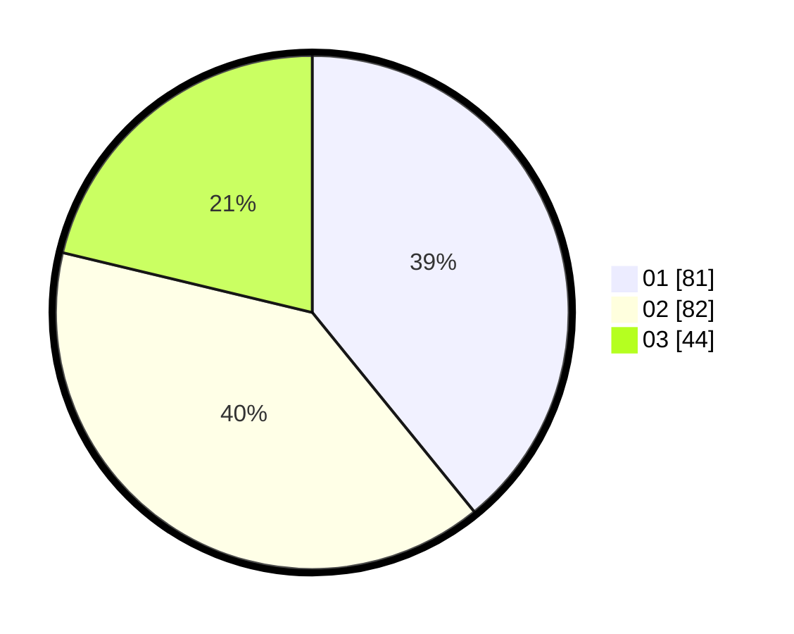

# Hasil

Hasil perolehan suara paslon dapat dilihat pada file paslon-01.txt, paslon-02.txt, dan paslon-03.txt.

Jika tidak ada, artinya data tersebut belum ada pada SIREKAP.

## Perolehan Suara

 * Paslon 01: **81**.
 * Paslon 02: **82**.
 * Paslon 03: **44**.

## Foto C Plano

https://sirekap-obj-formc.kpu.go.id/0e50/pemilu/ppwp/31/73/01/10/03/3173011003201-20240215-223249--1b2e11ab-1424-4e95-90b7-43394f9d05df.jpg

https://sirekap-obj-formc.kpu.go.id/0e50/pemilu/ppwp/31/73/01/10/03/3173011003201-20240215-223251--5a18ff2d-e7a5-4d7e-a625-595d8ca6ad10.jpg

https://sirekap-obj-formc.kpu.go.id/0e50/pemilu/ppwp/31/73/01/10/03/3173011003201-20240215-223250--d95735ed-22d8-4c9c-a4c9-33fa16bb4f8f.jpg

## DATA PEMILIH TETAP

Jumlah pemilih dalam DPT: **269**.
 * L: **119**.
 * P: **150**.

## DATA PENGGUNA HAK PILIH

Jumlah pengguna hak pilih dalam DPT: **213**.
 * L: **103**.
 * P: **110**.

Jumlah pengguna hak pilih dalam DPTb: **0**.
 * L: **0**.
 * P: **0**.

Jumlah pengguna hak pilih dalam DPK: **0**.
 * L: **0**.
 * P: **0**.

Jumlah pengguna hak pilih: **0**.
 * L: **0**.
 * P: **0**.

## JUMLAH SUARA SAH DAN TIDAK SAH

JUMLAH SELURUH SUARA SAH: **207**.

JUMLAH SUARA TIDAK SAH: **6**.

JUMLAH SELURUH SUARA SAH DAN SUARA TIDAK SAH: **213**.
