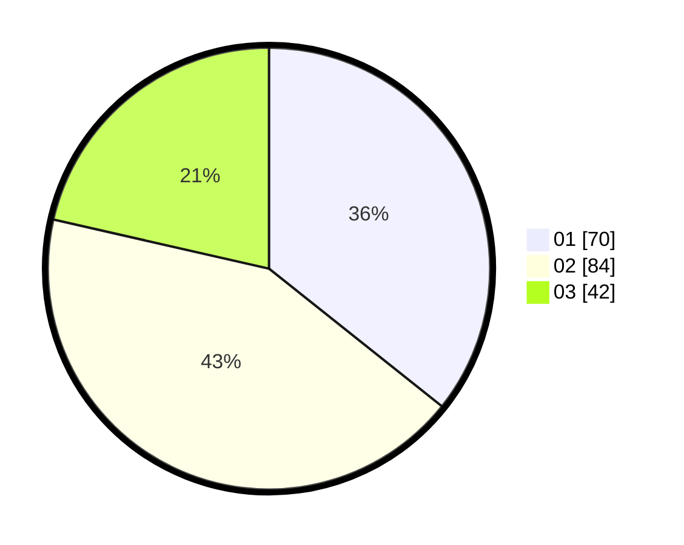

# Hasil

Hasil perolehan suara paslon dapat dilihat pada file paslon-01.txt, paslon-02.txt, dan paslon-03.txt.

Jika tidak ada, artinya data tersebut belum ada pada SIREKAP.

## Perolehan Suara

 * Paslon 01: **70**.
 * Paslon 02: **84**.
 * Paslon 03: **42**.

## Foto C Plano

https://sirekap-obj-formc.kpu.go.id/46cf/pemilu/ppwp/31/73/01/10/03/3173011003202-20240216-034619--6ce1430b-a70f-4083-b001-11121e09434a.jpg

https://sirekap-obj-formc.kpu.go.id/46cf/pemilu/ppwp/31/73/01/10/03/3173011003202-20240216-034621--40dfcd22-55e3-4229-b30d-fd63a94346ea.jpg

https://sirekap-obj-formc.kpu.go.id/46cf/pemilu/ppwp/31/73/01/10/03/3173011003202-20240216-034620--5aebe4ad-8064-436a-94ad-485015012d6d.jpg

## DATA PEMILIH TETAP

Jumlah pemilih dalam DPT: **276**.
 * L: **132**.
 * P: **144**.

## DATA PENGGUNA HAK PILIH

Jumlah pengguna hak pilih dalam DPT: **196**.
 * L: **86**.
 * P: **110**.

Jumlah pengguna hak pilih dalam DPTb: **0**.
 * L: **0**.
 * P: **0**.

Jumlah pengguna hak pilih dalam DPK: **4**.
 * L: **3**.
 * P: **1**.

Jumlah pengguna hak pilih: **200**.
 * L: **89**.
 * P: **111**.

## JUMLAH SUARA SAH DAN TIDAK SAH

JUMLAH SELURUH SUARA SAH: **196**.

JUMLAH SUARA TIDAK SAH: **4**.

JUMLAH SELURUH SUARA SAH DAN SUARA TIDAK SAH: **200**.
