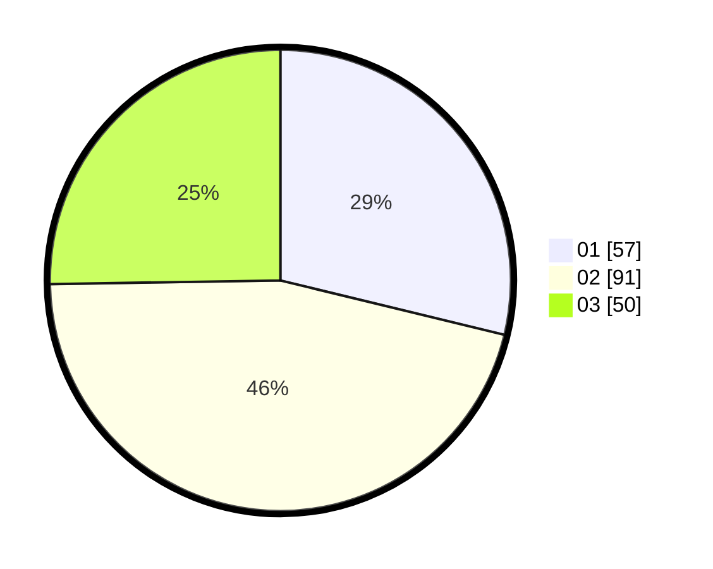

# Hasil

Hasil perolehan suara paslon dapat dilihat pada file paslon-01.txt, paslon-02.txt, dan paslon-03.txt.

Jika tidak ada, artinya data tersebut belum ada pada SIREKAP.

## Perolehan Suara

 * Paslon 01: **57**.
 * Paslon 02: **91**.
 * Paslon 03: **50**.

## Foto C Plano

https://sirekap-obj-formc.kpu.go.id/6fc8/pemilu/ppwp/31/73/01/10/03/3173011003204-20240216-033121--5c6d10e0-7d4a-42c8-b42b-49a4cd3e3b3a.jpg

https://sirekap-obj-formc.kpu.go.id/6fc8/pemilu/ppwp/31/73/01/10/03/3173011003204-20240216-033137--b90d3cba-c0fe-4eba-830b-8aebde9417bf.jpg

https://sirekap-obj-formc.kpu.go.id/6fc8/pemilu/ppwp/31/73/01/10/03/3173011003204-20240216-033545--89915a86-8ec2-4a13-b4b5-c0a7e88519b6.jpg

## DATA PEMILIH TETAP

Jumlah pemilih dalam DPT: **265**.
 * L: **99**.
 * P: **166**.

## DATA PENGGUNA HAK PILIH

Jumlah pengguna hak pilih dalam DPT: **196**.
 * L: **89**.
 * P: **107**.

Jumlah pengguna hak pilih dalam DPTb: **0**.
 * L: **0**.
 * P: **0**.

Jumlah pengguna hak pilih dalam DPK: **5**.
 * L: **2**.
 * P: **3**.

Jumlah pengguna hak pilih: **201**.
 * L: **91**.
 * P: **110**.

## JUMLAH SUARA SAH DAN TIDAK SAH

JUMLAH SELURUH SUARA SAH: **198**.

JUMLAH SUARA TIDAK SAH: **3**.

JUMLAH SELURUH SUARA SAH DAN SUARA TIDAK SAH: **201**.
