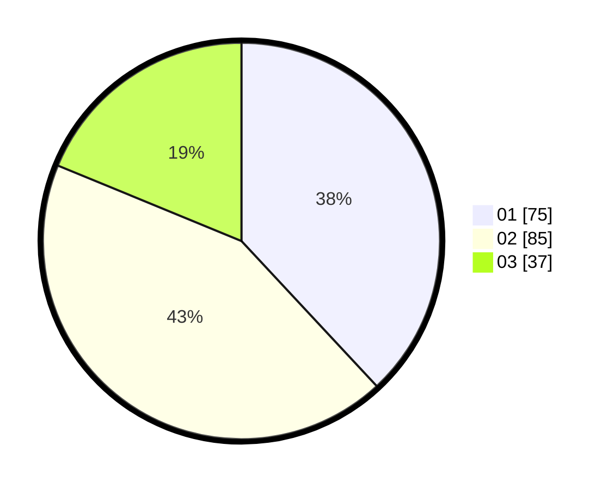

# Hasil

Hasil perolehan suara paslon dapat dilihat pada file paslon-01.txt, paslon-02.txt, dan paslon-03.txt.

Jika tidak ada, artinya data tersebut belum ada pada SIREKAP.

## Perolehan Suara

 * Paslon 01: **75**.
 * Paslon 02: **85**.
 * Paslon 03: **37**.

## Foto C Plano

https://sirekap-obj-formc.kpu.go.id/c1a5/pemilu/ppwp/31/73/01/10/03/3173011003207-20240215-211846--6e825d74-3f38-40bb-a8b6-cd90269b61b3.jpg

https://sirekap-obj-formc.kpu.go.id/c1a5/pemilu/ppwp/31/73/01/10/03/3173011003207-20240215-211849--ec6e156d-0387-4511-b0ef-50c6469546fb.jpg

https://sirekap-obj-formc.kpu.go.id/c1a5/pemilu/ppwp/31/73/01/10/03/3173011003207-20240215-211847--7f39e1d3-92e2-4a45-a5bd-3fc95fafc82c.jpg

## DATA PEMILIH TETAP

Jumlah pemilih dalam DPT: **271**.
 * L: **137**.
 * P: **134**.

## DATA PENGGUNA HAK PILIH

Jumlah pengguna hak pilih dalam DPT: **194**.
 * L: **93**.
 * P: **101**.

Jumlah pengguna hak pilih dalam DPTb: **2**.
 * L: **1**.
 * P: **1**.

Jumlah pengguna hak pilih dalam DPK: **4**.
 * L: **3**.
 * P: **1**.

Jumlah pengguna hak pilih: **200**.
 * L: **97**.
 * P: **103**.

## JUMLAH SUARA SAH DAN TIDAK SAH

JUMLAH SELURUH SUARA SAH: **197**.

JUMLAH SUARA TIDAK SAH: **3**.

JUMLAH SELURUH SUARA SAH DAN SUARA TIDAK SAH: **200**.
