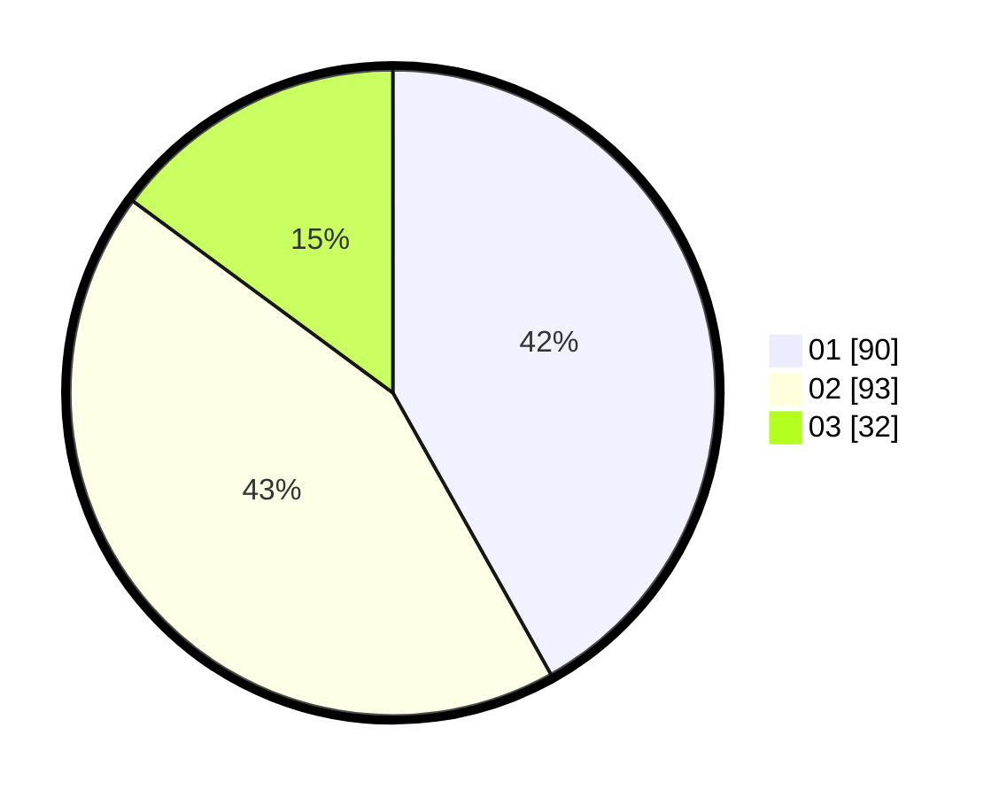

# Hasil

Hasil perolehan suara paslon dapat dilihat pada file paslon-01.txt, paslon-02.txt, dan paslon-03.txt.

Jika tidak ada, artinya data tersebut belum ada pada SIREKAP.

## Perolehan Suara

 * Paslon 01: **90**.
 * Paslon 02: **93**.
 * Paslon 03: **32**.

## Foto C Plano

https://sirekap-obj-formc.kpu.go.id/0234/pemilu/ppwp/31/73/01/10/03/3173011003210-20240216-040410--e70d4f21-dbbb-424a-9380-881cbbc24613.jpg

https://sirekap-obj-formc.kpu.go.id/0234/pemilu/ppwp/31/73/01/10/03/3173011003210-20240216-040411--617ad0e5-85cb-495f-8fe2-646fe517dd4f.jpg

https://sirekap-obj-formc.kpu.go.id/0234/pemilu/ppwp/31/73/01/10/03/3173011003210-20240216-040410--ae6531d0-332d-4201-8a9b-03ee01fc7f17.jpg

## DATA PEMILIH TETAP

Jumlah pemilih dalam DPT: **268**.
 * L: **137**.
 * P: **131**.

## DATA PENGGUNA HAK PILIH

Jumlah pengguna hak pilih dalam DPT: **216**.
 * L: **111**.
 * P: **105**.

Jumlah pengguna hak pilih dalam DPTb: **0**.
 * L: **0**.
 * P: **0**.

Jumlah pengguna hak pilih dalam DPK: **1**.
 * L: **0**.
 * P: **1**.

Jumlah pengguna hak pilih: **217**.
 * L: **111**.
 * P: **106**.

## JUMLAH SUARA SAH DAN TIDAK SAH

JUMLAH SELURUH SUARA SAH: **215**.

JUMLAH SUARA TIDAK SAH: **2**.

JUMLAH SELURUH SUARA SAH DAN SUARA TIDAK SAH: **217**.
