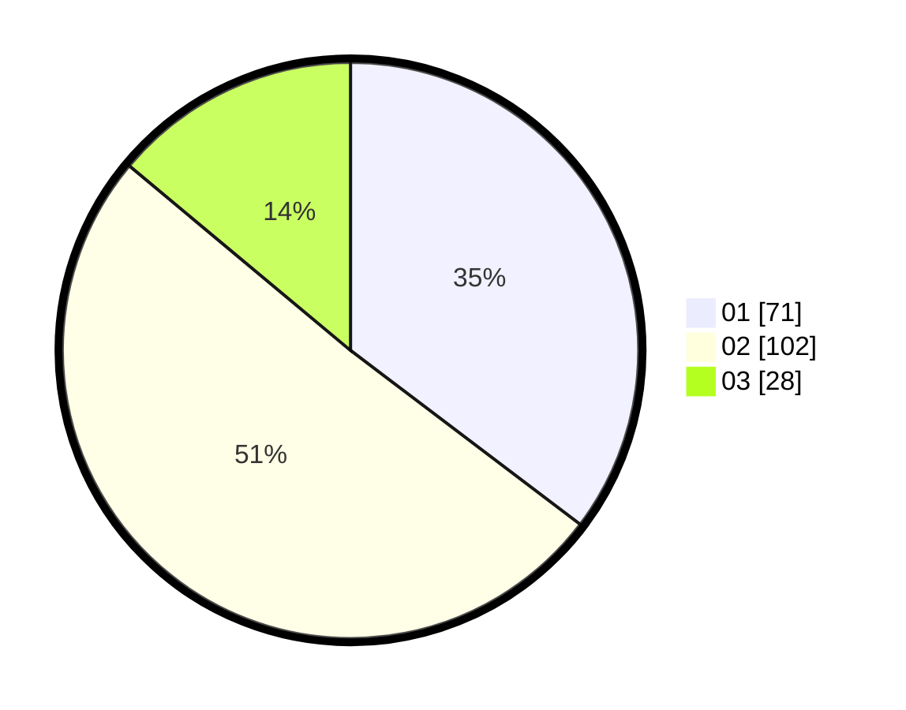

# Hasil

Hasil perolehan suara paslon dapat dilihat pada file paslon-01.txt, paslon-02.txt, dan paslon-03.txt.

Jika tidak ada, artinya data tersebut belum ada pada SIREKAP.

## Perolehan Suara

 * Paslon 01: **71**.
 * Paslon 02: **102**.
 * Paslon 03: **28**.

## Foto C Plano

https://sirekap-obj-formc.kpu.go.id/105c/pemilu/ppwp/31/73/01/10/03/3173011003211-20240214-160118--c708c5b8-3008-4d88-bbd5-ea92d6ae4fcf.jpg

https://sirekap-obj-formc.kpu.go.id/105c/pemilu/ppwp/31/73/01/10/03/3173011003211-20240214-155606--a7e02ca7-6ba1-4fe3-900d-5b39c24cdbde.jpg

https://sirekap-obj-formc.kpu.go.id/105c/pemilu/ppwp/31/73/01/10/03/3173011003211-20240214-160102--fd40743c-66ef-4436-ae99-76c8c11738cd.jpg
