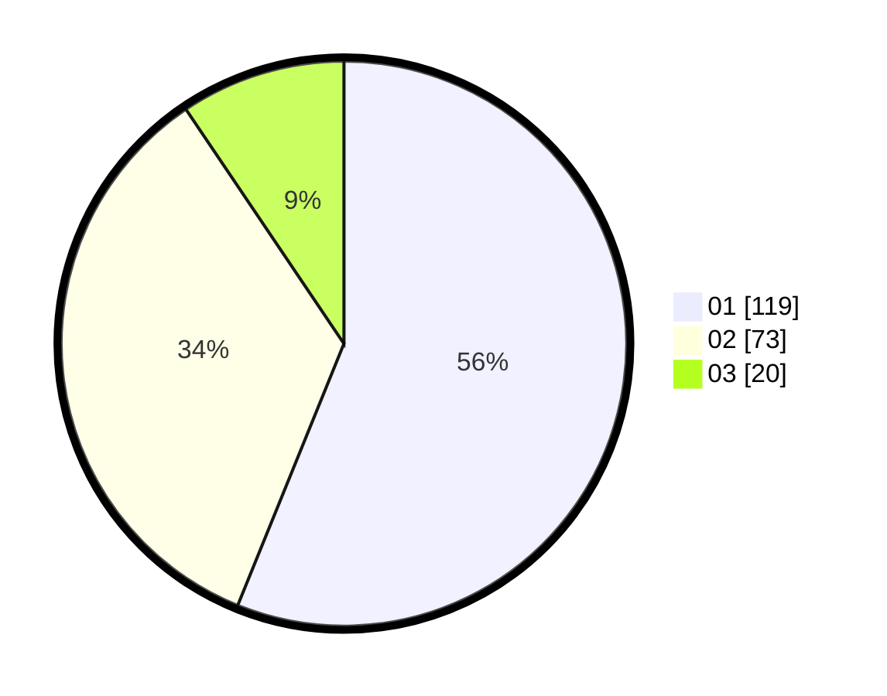

# Hasil

Hasil perolehan suara paslon dapat dilihat pada file paslon-01.txt, paslon-02.txt, dan paslon-03.txt.

Jika tidak ada, artinya data tersebut belum ada pada SIREKAP.

## Perolehan Suara

 * Paslon 01: **119**.
 * Paslon 02: **73**.
 * Paslon 03: **20**.

## Foto C Plano

https://sirekap-obj-formc.kpu.go.id/25cd/pemilu/ppwp/31/73/01/10/03/3173011003217-20240214-222627--12b57875-fab6-493e-947d-a21f3e13b06d.jpg

https://sirekap-obj-formc.kpu.go.id/25cd/pemilu/ppwp/31/73/01/10/03/3173011003217-20240214-222828--ab50e1bb-b1c6-413f-a13e-4107507481b5.jpg

https://sirekap-obj-formc.kpu.go.id/25cd/pemilu/ppwp/31/73/01/10/03/3173011003217-20240214-222931--603d8c81-431d-4b56-8611-b675434e5639.jpg
