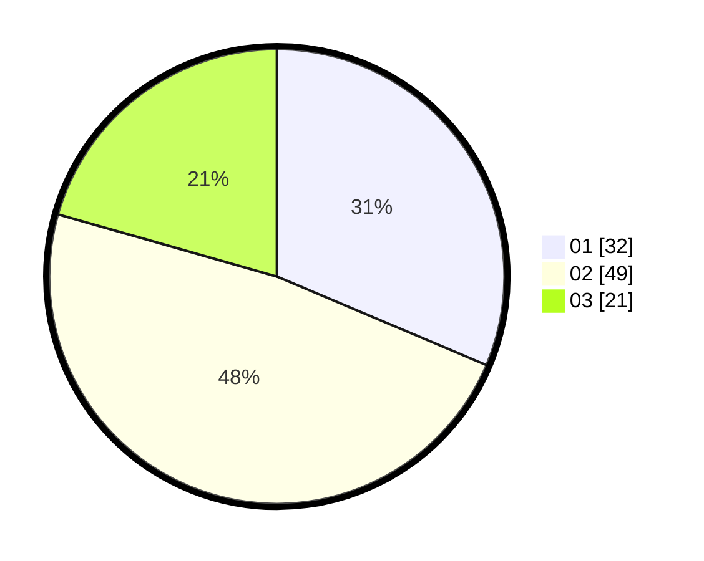

# Hasil

Hasil perolehan suara paslon dapat dilihat pada file paslon-01.txt, paslon-02.txt, dan paslon-03.txt.

Jika tidak ada, artinya data tersebut belum ada pada SIREKAP.

## Perolehan Suara

 * Paslon 01: **32**.
 * Paslon 02: **49**.
 * Paslon 03: **21**.

## Foto C Plano

https://sirekap-obj-formc.kpu.go.id/dd5e/pemilu/ppwp/31/73/01/10/03/3173011003221-20240214-234325--af1eddde-43eb-4e04-8dc5-a844ecefee6f.jpg

https://sirekap-obj-formc.kpu.go.id/dd5e/pemilu/ppwp/31/73/01/10/03/3173011003221-20240214-234340--fa68e5af-256b-407d-b659-629b145a2842.jpg

https://sirekap-obj-formc.kpu.go.id/dd5e/pemilu/ppwp/31/73/01/10/03/3173011003221-20240214-234400--b5f7abf9-91ad-4f02-93ae-b9751e2b585c.jpg

## DATA PEMILIH TETAP

Jumlah pemilih dalam DPT: **130**.
 * L: **69**.
 * P: **61**.

## DATA PENGGUNA HAK PILIH

Jumlah pengguna hak pilih dalam DPT: **97**.
 * L: **52**.
 * P: **45**.

Jumlah pengguna hak pilih dalam DPTb: **5**.
 * L: **3**.
 * P: **2**.

Jumlah pengguna hak pilih dalam DPK: **1**.
 * L: **1**.
 * P: **0**.

Jumlah pengguna hak pilih: **103**.
 * L: **56**.
 * P: **47**.

## JUMLAH SUARA SAH DAN TIDAK SAH

JUMLAH SELURUH SUARA SAH: **102**.

JUMLAH SUARA TIDAK SAH: **1**.

JUMLAH SELURUH SUARA SAH DAN SUARA TIDAK SAH: **103**.
