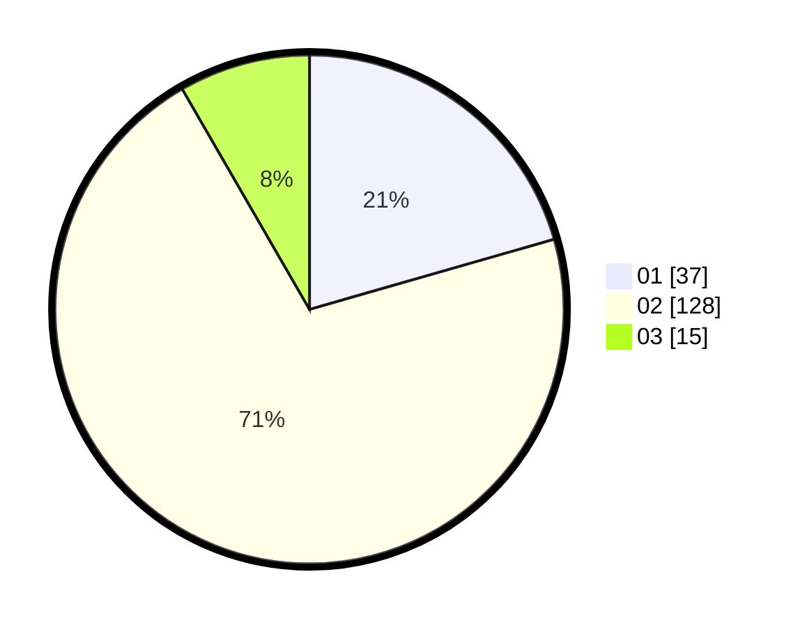

# Hasil

Hasil perolehan suara paslon dapat dilihat pada file paslon-01.txt, paslon-02.txt, dan paslon-03.txt.

Jika tidak ada, artinya data tersebut belum ada pada SIREKAP.

## Perolehan Suara

 * Paslon 01: **37**.
 * Paslon 02: **128**.
 * Paslon 03: **15**.

## Foto C Plano

https://sirekap-obj-formc.kpu.go.id/27a9/pemilu/ppwp/31/73/01/10/04/3173011004001-20240216-045238--1787d1b9-c57b-458b-910f-638d8c9b9882.jpg

https://sirekap-obj-formc.kpu.go.id/27a9/pemilu/ppwp/31/73/01/10/04/3173011004001-20240216-045241--d64e96d5-e48a-4f4b-9db5-9bb0e3e7d548.jpg

https://sirekap-obj-formc.kpu.go.id/27a9/pemilu/ppwp/31/73/01/10/04/3173011004001-20240216-045239--89c71d73-c7fd-456a-acb7-f8546b5bd481.jpg

## DATA PEMILIH TETAP

Jumlah pemilih dalam DPT: **293**.
 * L: **149**.
 * P: **144**.

## DATA PENGGUNA HAK PILIH

Jumlah pengguna hak pilih dalam DPT: **182**.
 * L: **86**.
 * P: **96**.

Jumlah pengguna hak pilih dalam DPTb: **3**.
 * L: **2**.
 * P: **1**.

Jumlah pengguna hak pilih dalam DPK: **1**.
 * L: **0**.
 * P: **1**.

Jumlah pengguna hak pilih: **186**.
 * L: **88**.
 * P: **98**.

## JUMLAH SUARA SAH DAN TIDAK SAH

JUMLAH SELURUH SUARA SAH: **180**.

JUMLAH SUARA TIDAK SAH: **6**.

JUMLAH SELURUH SUARA SAH DAN SUARA TIDAK SAH: **186**.
