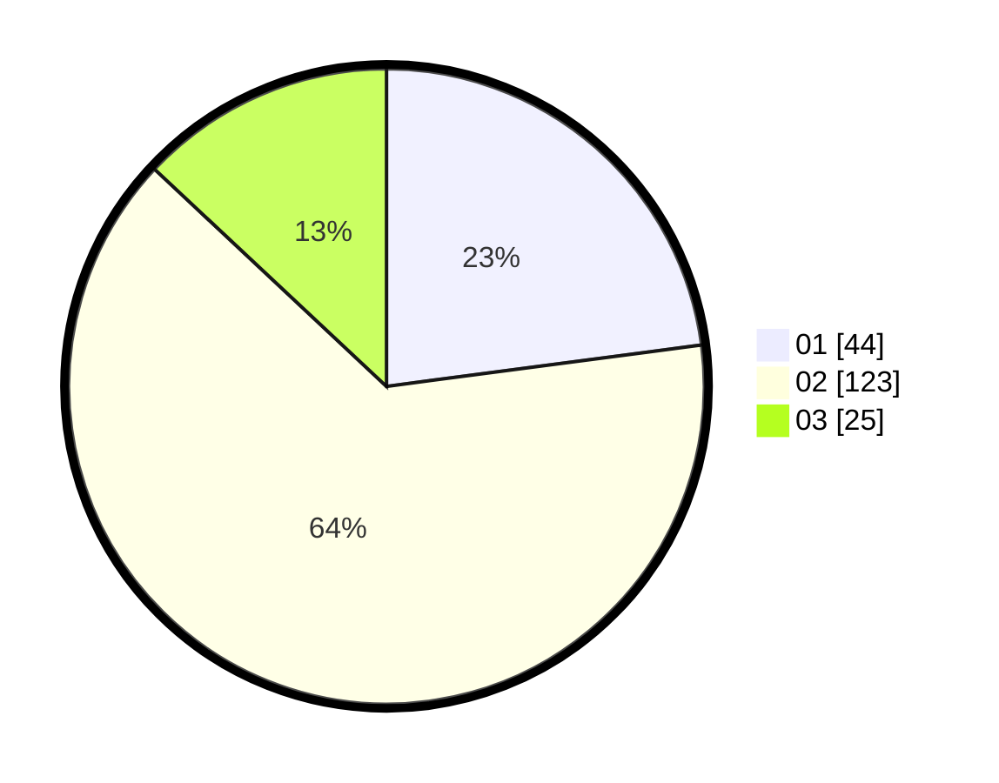

# Hasil

Hasil perolehan suara paslon dapat dilihat pada file paslon-01.txt, paslon-02.txt, dan paslon-03.txt.

Jika tidak ada, artinya data tersebut belum ada pada SIREKAP.

## Perolehan Suara

 * Paslon 01: **44**.
 * Paslon 02: **123**.
 * Paslon 03: **25**.

## Foto C Plano

https://sirekap-obj-formc.kpu.go.id/749a/pemilu/ppwp/31/73/01/10/04/3173011004003-20240214-191025--23fd6d73-d38d-4055-b912-a73400957cd0.jpg

https://sirekap-obj-formc.kpu.go.id/749a/pemilu/ppwp/31/73/01/10/04/3173011004003-20240214-191149--7d0af185-8854-4c53-8401-169415c5d20c.jpg

https://sirekap-obj-formc.kpu.go.id/749a/pemilu/ppwp/31/73/01/10/04/3173011004003-20240214-185904--64aae1f9-51ae-404d-8f04-f4616d48fe10.jpg

## DATA PEMILIH TETAP

Jumlah pemilih dalam DPT: **287**.
 * L: **144**.
 * P: **143**.

## DATA PENGGUNA HAK PILIH

Jumlah pengguna hak pilih dalam DPT: **198**.
 * L: **94**.
 * P: **104**.

Jumlah pengguna hak pilih dalam DPTb: **400**.
 * L: **0**.
 * P: **0**.

Jumlah pengguna hak pilih dalam DPK: **0**.
 * L: **0**.
 * P: **0**.

Jumlah pengguna hak pilih: **198**.
 * L: **94**.
 * P: **104**.

## JUMLAH SUARA SAH DAN TIDAK SAH

JUMLAH SELURUH SUARA SAH: **196**.

JUMLAH SUARA TIDAK SAH: **2**.

JUMLAH SELURUH SUARA SAH DAN SUARA TIDAK SAH: **198**.
