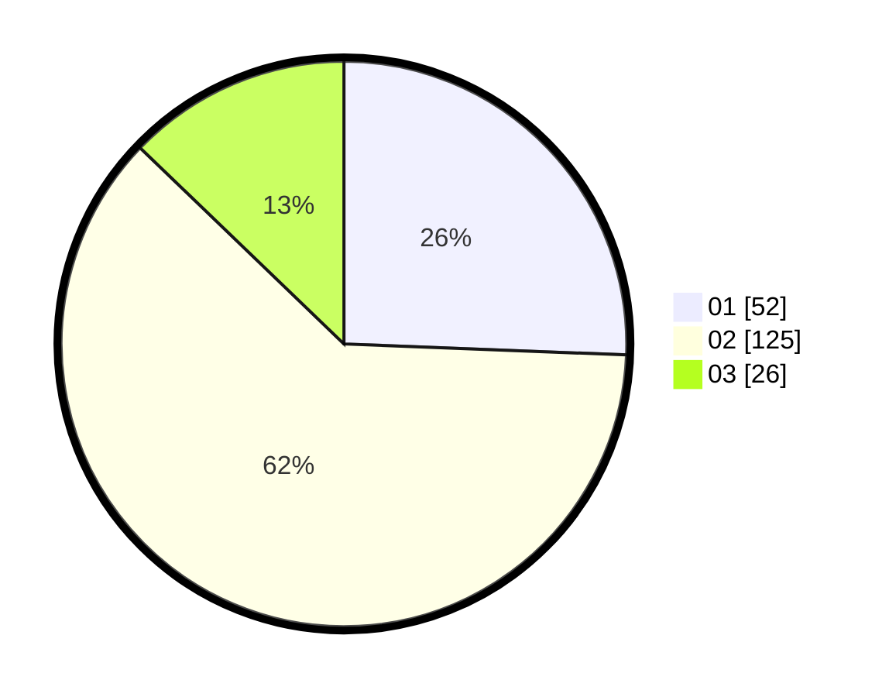

# Hasil

Hasil perolehan suara paslon dapat dilihat pada file paslon-01.txt, paslon-02.txt, dan paslon-03.txt.

Jika tidak ada, artinya data tersebut belum ada pada SIREKAP.

## Perolehan Suara

 * Paslon 01: **52**.
 * Paslon 02: **125**.
 * Paslon 03: **26**.

## Foto C Plano

https://sirekap-obj-formc.kpu.go.id/616e/pemilu/ppwp/31/73/01/10/04/3173011004004-20240216-032205--e4be37c4-f94a-4dd2-b813-d3cc677623da.jpg

https://sirekap-obj-formc.kpu.go.id/616e/pemilu/ppwp/31/73/01/10/04/3173011004004-20240216-051633--138394bf-684f-476e-b9a5-72f95a91cb63.jpg

https://sirekap-obj-formc.kpu.go.id/616e/pemilu/ppwp/31/73/01/10/04/3173011004004-20240216-051632--86e2e88f-1140-4a32-9c76-b01d1e12c706.jpg

## DATA PEMILIH TETAP

Jumlah pemilih dalam DPT: **290**.
 * L: **153**.
 * P: **137**.

## DATA PENGGUNA HAK PILIH

Jumlah pengguna hak pilih dalam DPT: **204**.
 * L: **106**.
 * P: **98**.

Jumlah pengguna hak pilih dalam DPTb: **1**.
 * L: **1**.
 * P: **0**.

Jumlah pengguna hak pilih dalam DPK: **2**.
 * L: **2**.
 * P: **0**.

Jumlah pengguna hak pilih: **207**.
 * L: **109**.
 * P: **98**.

## JUMLAH SUARA SAH DAN TIDAK SAH

JUMLAH SELURUH SUARA SAH: **203**.

JUMLAH SUARA TIDAK SAH: **4**.

JUMLAH SELURUH SUARA SAH DAN SUARA TIDAK SAH: **207**.
