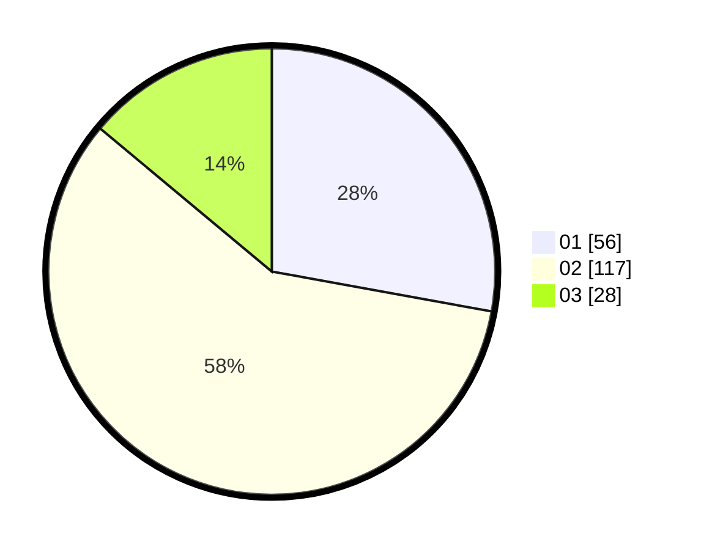

# Hasil

Hasil perolehan suara paslon dapat dilihat pada file paslon-01.txt, paslon-02.txt, dan paslon-03.txt.

Jika tidak ada, artinya data tersebut belum ada pada SIREKAP.

## Perolehan Suara

 * Paslon 01: **56**.
 * Paslon 02: **117**.
 * Paslon 03: **28**.

## Foto C Plano

https://sirekap-obj-formc.kpu.go.id/a04a/pemilu/ppwp/31/73/01/10/04/3173011004005-20240216-075852--62a6ffef-72a1-451b-903b-c837ee8a60e0.jpg

https://sirekap-obj-formc.kpu.go.id/a04a/pemilu/ppwp/31/73/01/10/04/3173011004005-20240216-075854--11053298-931e-457e-bc44-c36168c98092.jpg

https://sirekap-obj-formc.kpu.go.id/a04a/pemilu/ppwp/31/73/01/10/04/3173011004005-20240216-075853--9f4c4fa6-3d97-4da3-b69a-6d80f94bca62.jpg

## DATA PEMILIH TETAP

Jumlah pemilih dalam DPT: **296**.
 * L: **153**.
 * P: **143**.

## DATA PENGGUNA HAK PILIH

Jumlah pengguna hak pilih dalam DPT: **205**.
 * L: **93**.
 * P: **112**.

Jumlah pengguna hak pilih dalam DPTb: **0**.
 * L: **0**.
 * P: **0**.

Jumlah pengguna hak pilih dalam DPK: **0**.
 * L: **0**.
 * P: **0**.

Jumlah pengguna hak pilih: **205**.
 * L: **93**.
 * P: **112**.

## JUMLAH SUARA SAH DAN TIDAK SAH

JUMLAH SELURUH SUARA SAH: **201**.

JUMLAH SUARA TIDAK SAH: **4**.

JUMLAH SELURUH SUARA SAH DAN SUARA TIDAK SAH: **205**.
