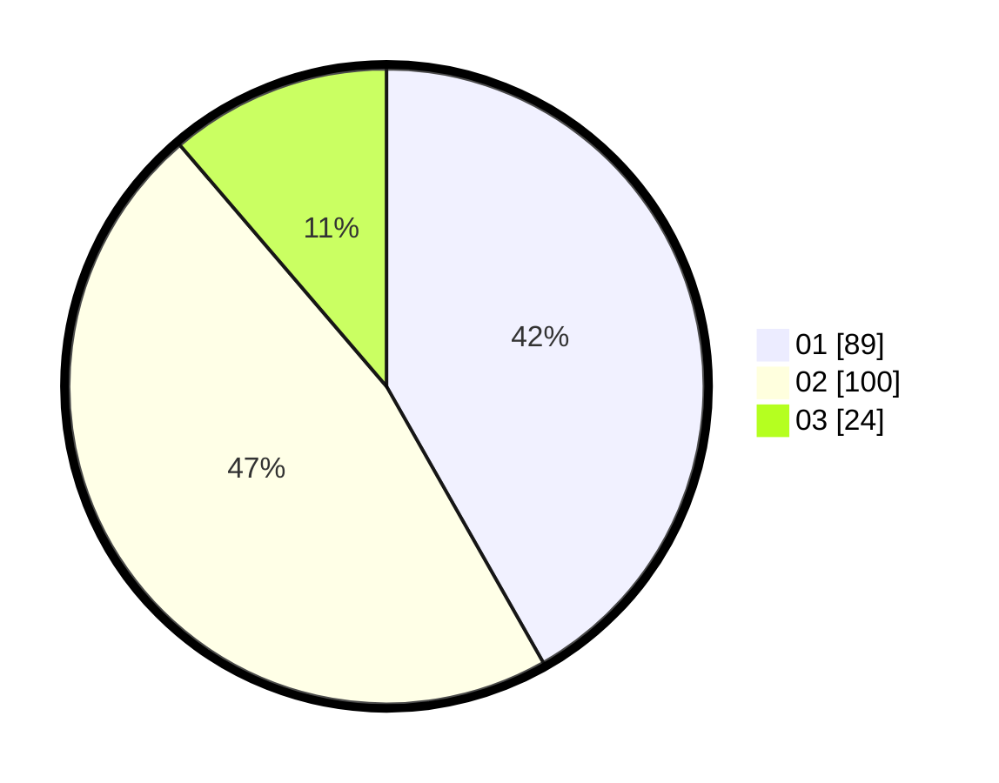

# Hasil

Hasil perolehan suara paslon dapat dilihat pada file paslon-01.txt, paslon-02.txt, dan paslon-03.txt.

Jika tidak ada, artinya data tersebut belum ada pada SIREKAP.

## Perolehan Suara

 * Paslon 01: **89**.
 * Paslon 02: **100**.
 * Paslon 03: **24**.

## Foto C Plano

https://sirekap-obj-formc.kpu.go.id/4221/pemilu/ppwp/31/73/01/10/04/3173011004016-20240215-213302--d241ad1b-0e9f-45bb-b4f0-4d9dad6b4f1f.jpg

https://sirekap-obj-formc.kpu.go.id/4221/pemilu/ppwp/31/73/01/10/04/3173011004016-20240215-213303--61a5ada9-e36e-40cb-b27a-bfbf8d938972.jpg

https://sirekap-obj-formc.kpu.go.id/4221/pemilu/ppwp/31/73/01/10/04/3173011004016-20240215-213302--36dd8c7b-95bd-4258-87b7-b78ce696a56c.jpg

## DATA PEMILIH TETAP

Jumlah pemilih dalam DPT: **291**.
 * L: **160**.
 * P: **131**.

## DATA PENGGUNA HAK PILIH

Jumlah pengguna hak pilih dalam DPT: **215**.
 * L: **108**.
 * P: **107**.

Jumlah pengguna hak pilih dalam DPTb: **1**.
 * L: **0**.
 * P: **1**.

Jumlah pengguna hak pilih dalam DPK: **2**.
 * L: **0**.
 * P: **2**.

Jumlah pengguna hak pilih: **218**.
 * L: **108**.
 * P: **110**.

## JUMLAH SUARA SAH DAN TIDAK SAH

JUMLAH SELURUH SUARA SAH: **213**.

JUMLAH SUARA TIDAK SAH: **5**.

JUMLAH SELURUH SUARA SAH DAN SUARA TIDAK SAH: **218**.
