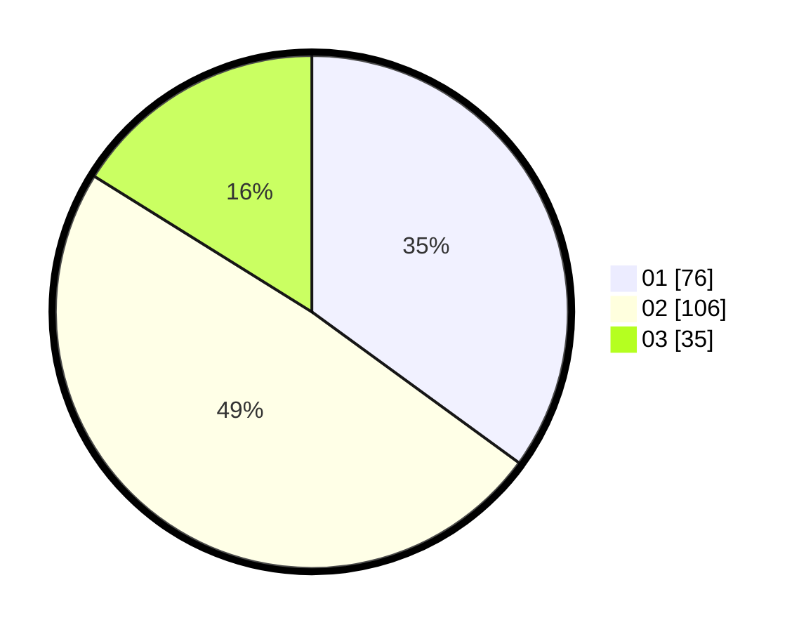

# Hasil

Hasil perolehan suara paslon dapat dilihat pada file paslon-01.txt, paslon-02.txt, dan paslon-03.txt.

Jika tidak ada, artinya data tersebut belum ada pada SIREKAP.

## Perolehan Suara

 * Paslon 01: **76**.
 * Paslon 02: **106**.
 * Paslon 03: **35**.

## Foto C Plano

https://sirekap-obj-formc.kpu.go.id/c2f6/pemilu/ppwp/31/73/01/10/04/3173011004023-20240214-184701--d57e2707-b66f-4342-9d7b-ae9e54b8b80c.jpg

https://sirekap-obj-formc.kpu.go.id/c2f6/pemilu/ppwp/31/73/01/10/04/3173011004023-20240214-184730--d920f25c-0ec7-4e2b-ae89-e8bbbf1fe261.jpg

https://sirekap-obj-formc.kpu.go.id/c2f6/pemilu/ppwp/31/73/01/10/04/3173011004023-20240214-185127--2987be98-8646-49e5-af85-c95634f1cc05.jpg

## DATA PEMILIH TETAP

Jumlah pemilih dalam DPT: **290**.
 * L: **159**.
 * P: **131**.

## DATA PENGGUNA HAK PILIH

Jumlah pengguna hak pilih dalam DPT: **216**.
 * L: **115**.
 * P: **101**.

Jumlah pengguna hak pilih dalam DPTb: **4**.
 * L: **2**.
 * P: **2**.

Jumlah pengguna hak pilih dalam DPK: **2**.
 * L: **1**.
 * P: **1**.

Jumlah pengguna hak pilih: **222**.
 * L: **118**.
 * P: **104**.

## JUMLAH SUARA SAH DAN TIDAK SAH

JUMLAH SELURUH SUARA SAH: **217**.

JUMLAH SUARA TIDAK SAH: **5**.

JUMLAH SELURUH SUARA SAH DAN SUARA TIDAK SAH: **222**.
