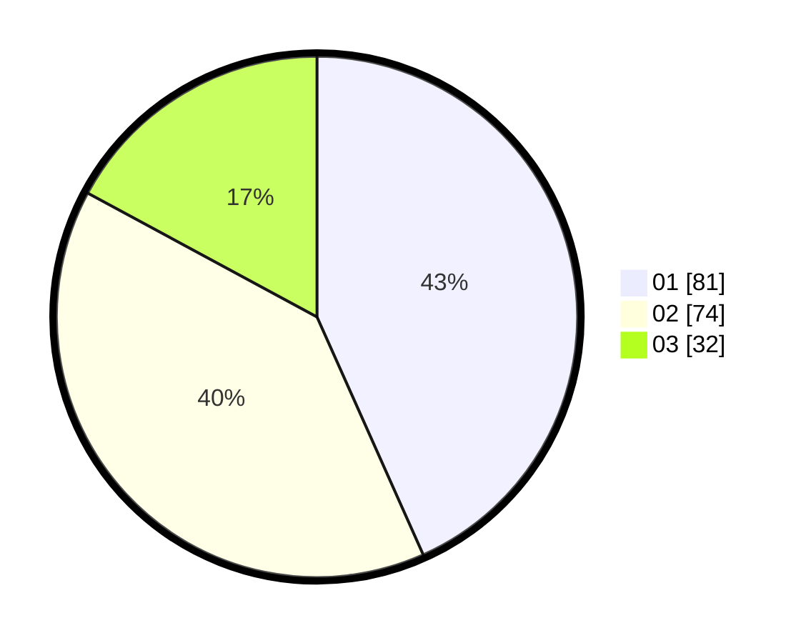

# Hasil

Hasil perolehan suara paslon dapat dilihat pada file paslon-01.txt, paslon-02.txt, dan paslon-03.txt.

Jika tidak ada, artinya data tersebut belum ada pada SIREKAP.

## Perolehan Suara

 * Paslon 01: **81**.
 * Paslon 02: **74**.
 * Paslon 03: **32**.

## Foto C Plano

https://sirekap-obj-formc.kpu.go.id/22d9/pemilu/ppwp/31/73/01/10/04/3173011004024-20240214-175308--ef827185-a337-4562-9794-1bab343b13eb.jpg

https://sirekap-obj-formc.kpu.go.id/22d9/pemilu/ppwp/31/73/01/10/04/3173011004024-20240216-115735--7fcbe9a7-db9c-4256-afaa-993927e12bd0.jpg

https://sirekap-obj-formc.kpu.go.id/22d9/pemilu/ppwp/31/73/01/10/04/3173011004024-20240214-230410--90ef4015-bac4-4343-b8a3-1e93c05acd41.jpg

## DATA PEMILIH TETAP

Jumlah pemilih dalam DPT: **253**.
 * L: **127**.
 * P: **126**.

## DATA PENGGUNA HAK PILIH

Jumlah pengguna hak pilih dalam DPT: **192**.
 * L: **94**.
 * P: **98**.

Jumlah pengguna hak pilih dalam DPTb: **0**.
 * L: **0**.
 * P: **0**.

Jumlah pengguna hak pilih dalam DPK: **0**.
 * L: **0**.
 * P: **0**.

Jumlah pengguna hak pilih: **192**.
 * L: **94**.
 * P: **98**.

## JUMLAH SUARA SAH DAN TIDAK SAH

JUMLAH SELURUH SUARA SAH: **187**.

JUMLAH SUARA TIDAK SAH: **5**.

JUMLAH SELURUH SUARA SAH DAN SUARA TIDAK SAH: **192**.
