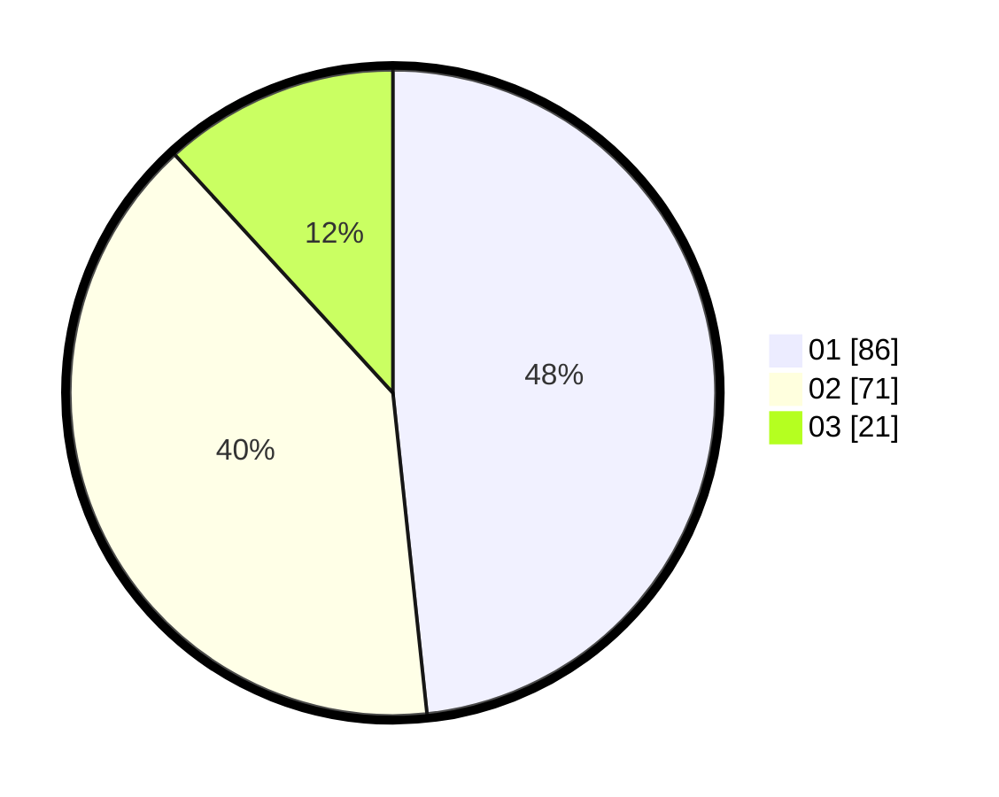

# Hasil

Hasil perolehan suara paslon dapat dilihat pada file paslon-01.txt, paslon-02.txt, dan paslon-03.txt.

Jika tidak ada, artinya data tersebut belum ada pada SIREKAP.

## Perolehan Suara

 * Paslon 01: **86**.
 * Paslon 02: **71**.
 * Paslon 03: **21**.

## Foto C Plano

https://sirekap-obj-formc.kpu.go.id/c9d7/pemilu/ppwp/31/73/01/10/04/3173011004026-20240214-155237--fa9677f1-563c-4176-b168-163eced7b715.jpg

https://sirekap-obj-formc.kpu.go.id/c9d7/pemilu/ppwp/31/73/01/10/04/3173011004026-20240214-155413--07528271-02ff-450b-a102-c4c8aba6506f.jpg

https://sirekap-obj-formc.kpu.go.id/c9d7/pemilu/ppwp/31/73/01/10/04/3173011004026-20240214-155327--2b9ae597-a863-4a5d-9766-29b912b7e672.jpg

## DATA PEMILIH TETAP

Jumlah pemilih dalam DPT: **249**.
 * L: **119**.
 * P: **130**.

## DATA PENGGUNA HAK PILIH

Jumlah pengguna hak pilih dalam DPT: **174**.
 * L: **80**.
 * P: **94**.

Jumlah pengguna hak pilih dalam DPTb: **4**.
 * L: **2**.
 * P: **2**.

Jumlah pengguna hak pilih dalam DPK: **4**.
 * L: **3**.
 * P: **1**.

Jumlah pengguna hak pilih: **182**.
 * L: **85**.
 * P: **97**.

## JUMLAH SUARA SAH DAN TIDAK SAH

JUMLAH SELURUH SUARA SAH: **178**.

JUMLAH SUARA TIDAK SAH: **4**.

JUMLAH SELURUH SUARA SAH DAN SUARA TIDAK SAH: **182**.
