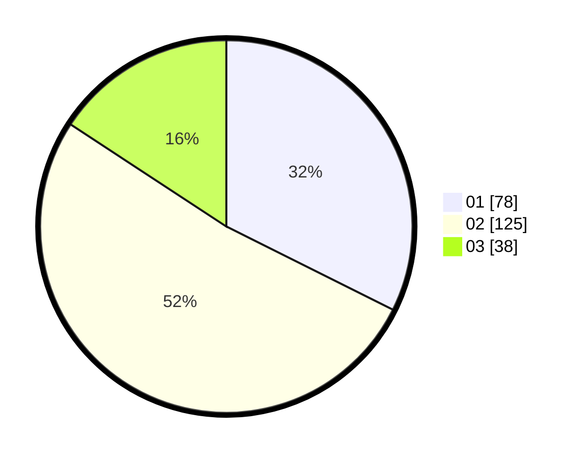

# Hasil

Hasil perolehan suara paslon dapat dilihat pada file paslon-01.txt, paslon-02.txt, dan paslon-03.txt.

Jika tidak ada, artinya data tersebut belum ada pada SIREKAP.

## Perolehan Suara

 * Paslon 01: **78**.
 * Paslon 02: **125**.
 * Paslon 03: **38**.

## Foto C Plano

https://sirekap-obj-formc.kpu.go.id/9531/pemilu/ppwp/31/73/01/10/04/3173011004031-20240214-222648--ca1f7689-2aec-45dd-9858-586ec18192a1.jpg

https://sirekap-obj-formc.kpu.go.id/9531/pemilu/ppwp/31/73/01/10/04/3173011004031-20240214-222848--8b201c79-ef48-4992-af8d-f0d3adb94e65.jpg

https://sirekap-obj-formc.kpu.go.id/9531/pemilu/ppwp/31/73/01/10/04/3173011004031-20240214-222926--243383e1-a656-4bae-9c9e-46dc7c6b7bc5.jpg
