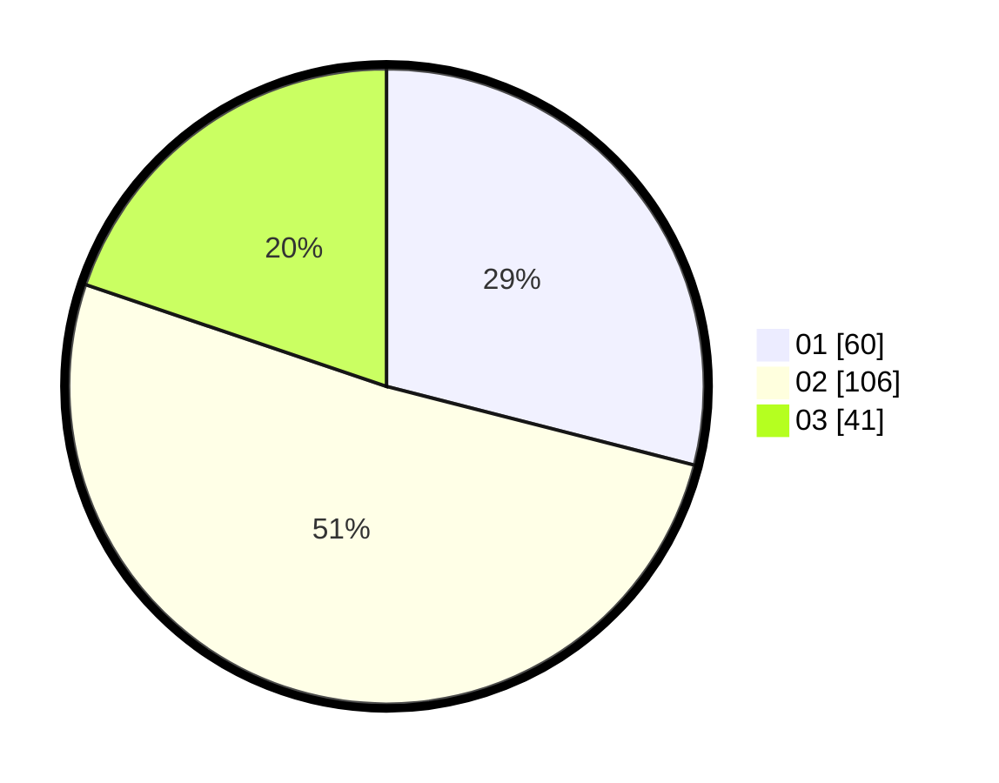

# Hasil

Hasil perolehan suara paslon dapat dilihat pada file paslon-01.txt, paslon-02.txt, dan paslon-03.txt.

Jika tidak ada, artinya data tersebut belum ada pada SIREKAP.

## Perolehan Suara

 * Paslon 01: **60**.
 * Paslon 02: **106**.
 * Paslon 03: **41**.

## Foto C Plano

https://sirekap-obj-formc.kpu.go.id/4072/pemilu/ppwp/31/73/01/10/04/3173011004033-20240214-232145--4d32edd5-7a30-42c8-8ad0-e77d22b41b1c.jpg

https://sirekap-obj-formc.kpu.go.id/4072/pemilu/ppwp/31/73/01/10/04/3173011004033-20240214-232252--e3379c32-9e00-4d4d-9798-ae3fd20bc2d7.jpg

https://sirekap-obj-formc.kpu.go.id/4072/pemilu/ppwp/31/73/01/10/04/3173011004033-20240215-035033--9f9f6c4f-dc86-484e-a3ee-4d51291c8132.jpg
