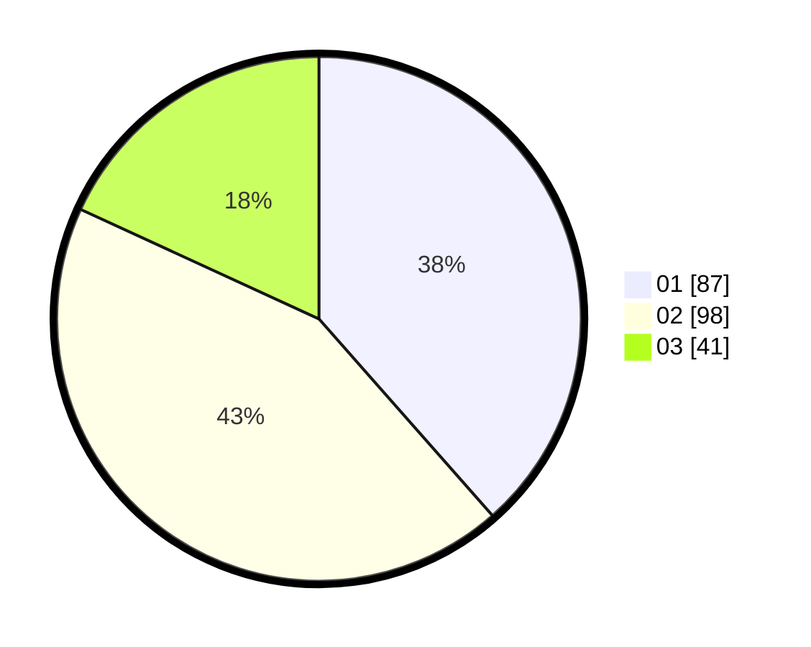

# Hasil

Hasil perolehan suara paslon dapat dilihat pada file paslon-01.txt, paslon-02.txt, dan paslon-03.txt.

Jika tidak ada, artinya data tersebut belum ada pada SIREKAP.

## Perolehan Suara

 * Paslon 01: **87**.
 * Paslon 02: **98**.
 * Paslon 03: **41**.

## Foto C Plano

https://sirekap-obj-formc.kpu.go.id/b581/pemilu/ppwp/31/73/01/10/04/3173011004036-20240214-191803--6726a197-e34e-4987-a377-8d4edd793206.jpg

https://sirekap-obj-formc.kpu.go.id/b581/pemilu/ppwp/31/73/01/10/04/3173011004036-20240214-192856--d774fe76-4860-4418-a285-dc0850ae9391.jpg

https://sirekap-obj-formc.kpu.go.id/b581/pemilu/ppwp/31/73/01/10/04/3173011004036-20240214-203647--a1279c54-e754-41e2-9c01-4f04ae225f9e.jpg
